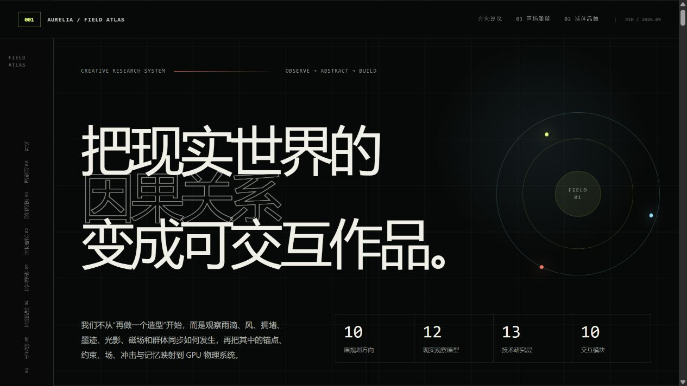
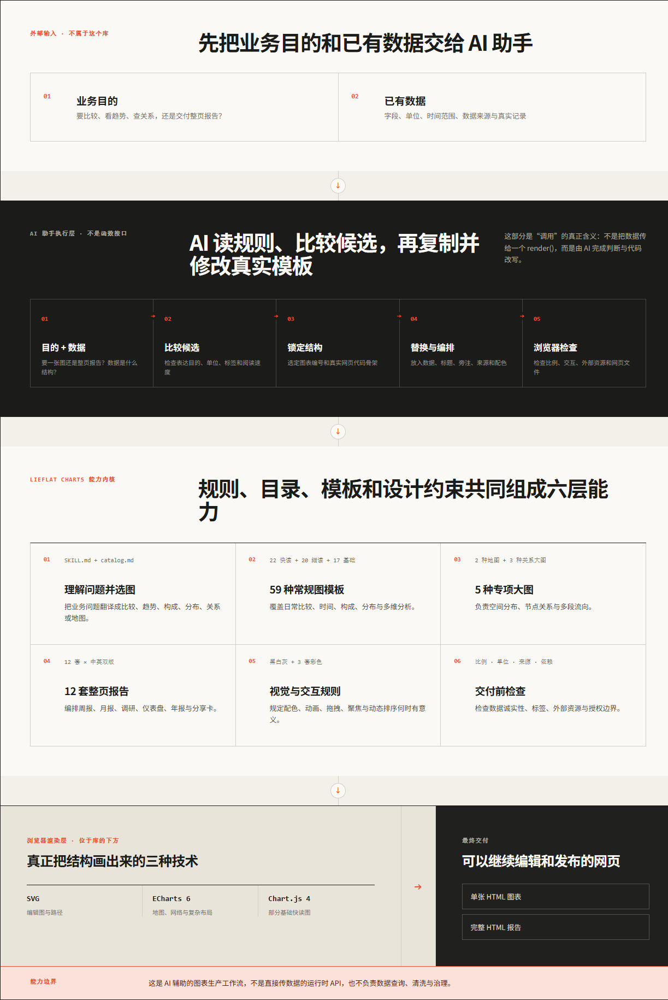
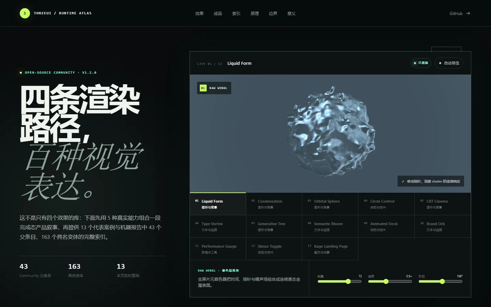
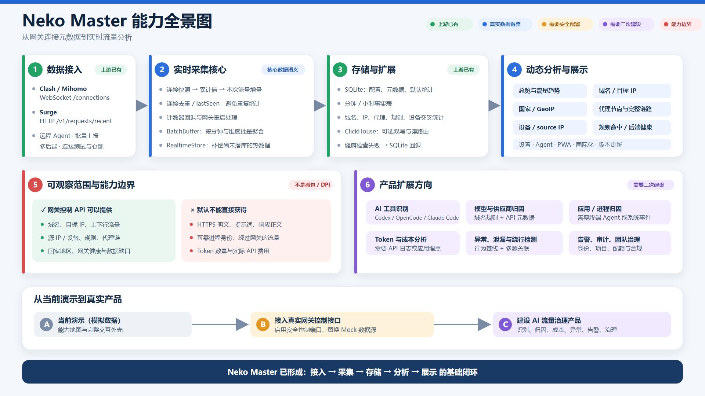
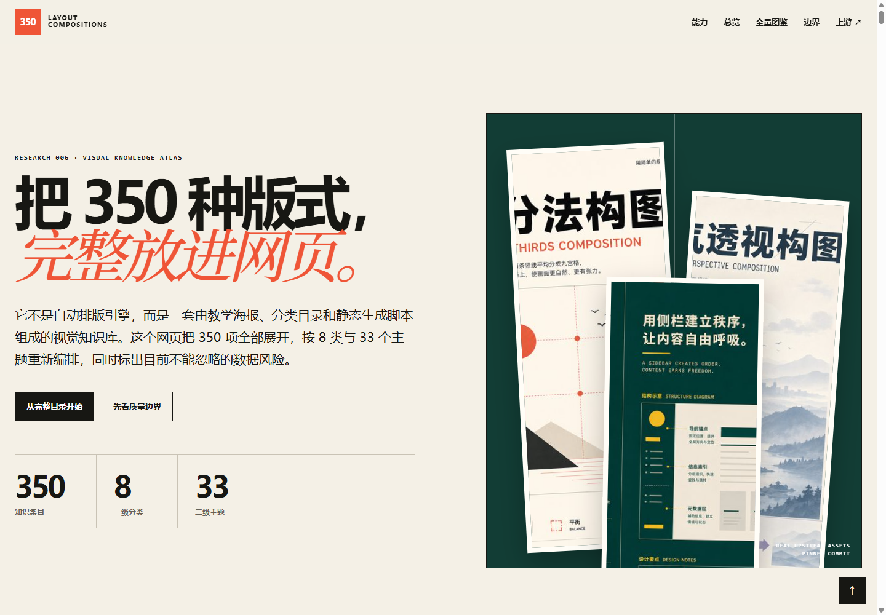
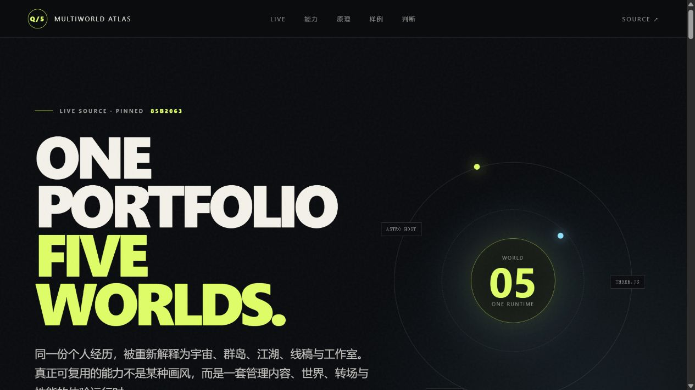
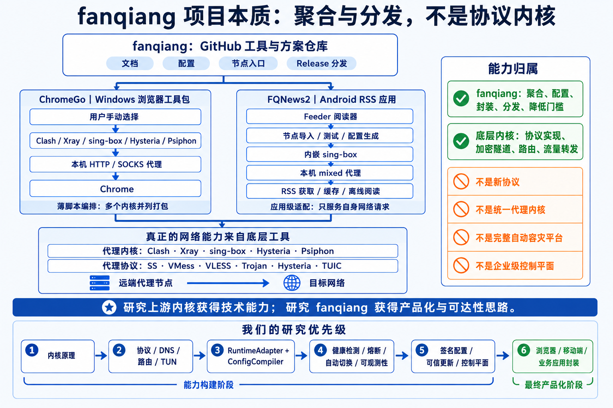

# 0902 Codex Project

> 一个持续研究优秀 GitHub 项目、沉淀可复用结论，并用小型 Web Demo 验证关键想法的总项目库。

[研究索引](#研究索引) · [核心演示图](#项目核心演示与架构图) · [研究规范](CONTRIBUTING.md) · [研究模板](research/_template/README.md) · [在线门户](https://yydshly.github.io/0902_codex_project/)

## 这个仓库记录什么

这里不是第三方源码的镜像集合。每个研究项目会围绕一个明确问题，记录上游版本、许可证、架构观察、关键实现、实验依据、适用边界和可复用经验；需要交互验证时，再增加一个独立 Web Demo。

根 README 保留摘要、入口、稳定索引和每个项目的一张核心图。完整研究、证据与逐图解释放在对应的 `research/` 子目录中，避免总览随着项目增加而失去可读性。

## 本次研究：Lieflat Charts

[Lieflat Charts](https://github.com/larashero3-dotcom/lieflat-charts) 不是新的运行时图表 SDK，而是一套面向 AI 助手的数据表达工作流：它把数据形状判断、图型选择、视觉约束、真实 HTML 模板和交付检查写成 Agent 可执行的规则。

本研究固定在上游 commit `4eef5ce`，梳理了 **64 种图表、12 套中英双语报告、4 种视觉系统**，并用六类真实业务任务解释什么时候选择什么效果。配套展厅支持完整中英切换，包含架构与能力总图，并可直接运行固定版本的 52 个原始 HTML 样张。

[阅读完整研究](./research/002-larashero3-dotcom-lieflat-charts/README.md) · [打开在线能力展厅](https://yydshly.github.io/0902_codex_project/demos/002-larashero3-dotcom-lieflat-charts/) · [查看上游源库](https://github.com/larashero3-dotcom/lieflat-charts)

## 研究索引

<!-- PROJECT_INDEX_START -->
| 编号 | 项目 | 一句话摘要 | 状态 | 标签 | 研究记录 | Web Demo | 最近更新 |
| ---: | --- | --- | --- | --- | --- | --- | --- |
| `001` | [Aurelia](https://github.com/holtsetio/aurelia/) | 从程序化水母出发，把 GPU 软体、动态材料、交互、声音和业务数据扩展为 15 个案例，并以研究总账记录能力证据、真实边界和下一阶段决策。 | 已验证 | `three.js` `webgpu` `compute` `procedural` `soft-body` `web-audio` `audio-reactive` | [查看](./research/001-holtsetio-aurelia/README.md) | [打开](https://yydshly.github.io/0902_codex_project/demos/001-holtsetio-aurelia/) | 2026-09-04 |
| `002` | [Lieflat Charts](https://github.com/larashero3-dotcom/lieflat-charts) | 把数据形状判断、图型选型、编辑设计规则和真实 HTML 模板编码成 Agent 可执行的数据可视化工作流。 | 已验证 | `agent-skills` `data-visualization` `html` `svg` `design-system` | [查看](./research/002-larashero3-dotcom-lieflat-charts/README.md) | [打开](https://yydshly.github.io/0902_codex_project/demos/002-larashero3-dotcom-lieflat-charts/) | 2026-09-03 |
| `003` | [ThreeUI](https://github.com/MengTo/threeui) | 以 48 个实时案例和 162 个可运行配置覆盖 43/43 个 Community 父能力，并用 Brief → PageSpec → 三层网页验证 ThreeUI 作为优秀网页生成系统视觉 Registry 的价值、边界与生产接入方式。 | 已验证 | `react` `three.js` `webgl` `canvas` `ui-components` `shaders` `agent-skills` | [查看](./research/003-mengto-threeui/README.md) | [打开](https://yydshly.github.io/0902_codex_project/demos/003-mengto-threeui/) | 2026-09-04 |
| `004` | [Neko Master](https://github.com/foru17/neko-master) | 研究代理网关如何把连接累计快照转换成实时、多维、可持久化的流量事实，并以合成数据验证差分、批量落库与热数据合并。 | 已验证 | `observability` `network` `realtime` `edge-agent` `sqlite` `clickhouse` | [查看](./research/004-foru17-neko-master/README.md) | [打开](https://yydshly.github.io/0902_codex_project/demos/004-foru17-neko-master/) | 2026-09-04 |
| `005` | [Yichen Skills](https://github.com/mcncarl/yichen-skills) | 确认 Yichen Skills 是由宿主 Agent 驱动的 22 项个人工作流能力库，而非 Agent 本体；全量展示其路由、执行、权限与验收，并提供按需采用决策和本地试用台账。 | 已验证 | `agent-skills` `workflow-automation` `research` `content-ops` `local-first` `safety` | [查看](./research/005-mcncarl-yichen-skills/README.md) | [打开](https://yydshly.github.io/0902_codex_project/demos/005-mcncarl-yichen-skills/) | 2026-09-04 |
| `006` | [350 Layout Compositions](https://github.com/nevertoday/350-layout-compositions) | 把 350 张版式教学海报、8×33 分类和机器目录完整整理成网页档案，并以当前仓库文章演示可解释选版及网页、轮播、知识图和 PPT 四种成品，同时标明语义映射风险。 | 已验证 | `layout` `composition` `visual-design` `taxonomy` `dataset` `static-gallery` | [查看](./research/006-nevertoday-350-layout-compositions/README.md) | [打开](https://yydshly.github.io/0902_codex_project/demos/006-nevertoday-350-layout-compositions/) | 2026-09-04 |
| `007` | [Qiuner.github.io](https://github.com/Qiuner/Qiuner.github.io) | 以五个实时 World、单一内容内核和共享 Runtime 拆解多世界作品集，并用六个真实研究项目演示如何构建可筛选、可验证、可运行的个人品牌证据系统。 | 已验证 | `astro` `three.js` `webgl` `multi-world` `interactive-portfolio` `runtime` | [查看](./research/007-qiuner-qiuner-github-io/README.md) | [打开](https://yydshly.github.io/0902_codex_project/demos/007-qiuner-qiuner-github-io/) | 2026-09-03 |
| `008` | [fanqiang](https://github.com/bannedbook/fanqiang) | 以源码调用链区分 fanqiang 分发仓库、ChromeGo 浏览器工具箱与 FQNews2 应用级代理产品，并把协议能力归还给 sing-box、Xray、Clash Meta 等上游内核。 | 已验证 | `network` `proxy` `sing-box` `android` `rss` `toolbox` `control-plane` | [查看](./research/008-bannedbook-fanqiang/README.md) | [打开](https://yydshly.github.io/0902_codex_project/demos/008-bannedbook-fanqiang/) | 2026-09-04 |
<!-- PROJECT_INDEX_END -->

## 项目核心演示与架构图

每个已登记项目必须提供一张能快速说明核心价值的图片：优先使用经过验证的真实 Demo 首屏或关键交互；没有单一最佳画面时，使用基于研究证据自制的架构图、能力总图或整体流程图。点击图片可进入在线 Demo 或完整研究。

<!-- PROJECT_SHOWCASE_START -->
### `001` · [Aurelia](https://github.com/holtsetio/aurelia/)

[](https://yydshly.github.io/0902_codex_project/demos/001-holtsetio-aurelia/)

*用研究图谱概括 Aurelia 如何把现实观察抽象为物理语法、GPU 状态与可交互体验。 · 本研究 Demo 自制截图；方法与讲解层原创，上游 Aurelia 代码遵循 MIT License*

从程序化水母出发，把 GPU 软体、动态材料、交互、声音和业务数据扩展为 15 个案例，并以研究总账记录能力证据、真实边界和下一阶段决策。

[阅读研究](./research/001-holtsetio-aurelia/README.md) · [打开 Demo](https://yydshly.github.io/0902_codex_project/demos/001-holtsetio-aurelia/) · [查看上游](https://github.com/holtsetio/aurelia/)

---

### `002` · [Lieflat Charts](https://github.com/larashero3-dotcom/lieflat-charts)

[](https://yydshly.github.io/0902_codex_project/demos/002-larashero3-dotcom-lieflat-charts/)

*一张图解释 Lieflat Charts 的输入、Agent 执行、规则与模板资产、底层渲染技术、六层能力和最终交付边界。 · 研究团队自制；不包含上游图表画面*

把数据形状判断、图型选型、编辑设计规则和真实 HTML 模板编码成 Agent 可执行的数据可视化工作流。

[阅读研究](./research/002-larashero3-dotcom-lieflat-charts/README.md) · [打开 Demo](https://yydshly.github.io/0902_codex_project/demos/002-larashero3-dotcom-lieflat-charts/) · [查看上游](https://github.com/larashero3-dotcom/lieflat-charts)

---

### `003` · [ThreeUI](https://github.com/MengTo/threeui)

[](https://yydshly.github.io/0902_codex_project/demos/003-mengto-threeui/)

*ThreeUI Runtime Atlas 将上游视觉素材整理为可按页面角色、运行时、成本和降级策略调用的 Registry，并生成可编辑三层网页。 · 自制研究展台；视觉 renderer 来自 ThreeUI Community（MIT）*

以 48 个实时案例和 162 个可运行配置覆盖 43/43 个 Community 父能力，并用 Brief → PageSpec → 三层网页验证 ThreeUI 作为优秀网页生成系统视觉 Registry 的价值、边界与生产接入方式。

[阅读研究](./research/003-mengto-threeui/README.md) · [打开 Demo](https://yydshly.github.io/0902_codex_project/demos/003-mengto-threeui/) · [查看上游](https://github.com/MengTo/threeui)

---

### `004` · [Neko Master](https://github.com/foru17/neko-master)

[](https://yydshly.github.io/0902_codex_project/demos/004-foru17-neko-master/)

*一张图说明从代理网关累计快照到实时流量分析的完整链路，以及上游已有能力与仍需建设的治理层。 · 研究团队基于固定版本源码与合成数据自制；不包含真实用户或网络流量*

研究代理网关如何把连接累计快照转换成实时、多维、可持久化的流量事实，并以合成数据验证差分、批量落库与热数据合并。

[阅读研究](./research/004-foru17-neko-master/README.md) · [打开 Demo](https://yydshly.github.io/0902_codex_project/demos/004-foru17-neko-master/) · [查看上游](https://github.com/foru17/neko-master)

---

### `005` · [Yichen Skills](https://github.com/mcncarl/yichen-skills)

[](https://yydshly.github.io/0902_codex_project/demos/005-mcncarl-yichen-skills/)

*核心演示图直接解释 Skill 库不是 Agent 本体，而是由宿主路由、协议、执行器和验收证据组成的工作系统。 · 本研究 Demo 自制截图；不包含账号、凭据、聊天内容或上游平台界面*

确认 Yichen Skills 是由宿主 Agent 驱动的 22 项个人工作流能力库，而非 Agent 本体；全量展示其路由、执行、权限与验收，并提供按需采用决策和本地试用台账。

[阅读研究](./research/005-mcncarl-yichen-skills/README.md) · [打开 Demo](https://yydshly.github.io/0902_codex_project/demos/005-mcncarl-yichen-skills/) · [查看上游](https://github.com/mcncarl/yichen-skills)

---

### `006` · [350 Layout Compositions](https://github.com/nevertoday/350-layout-compositions)

[](https://yydshly.github.io/0902_codex_project/demos/006-nevertoday-350-layout-compositions/)

*全量网页档案将 350 项视觉知识、8×33 分类、静态生产管线和数据质量边界放进同一可检索展示，并演示文章到四种媒介成品的最小编排链路。 · 自制 Demo 截图；内嵌上游海报遵循 CC BY 4.0*

把 350 张版式教学海报、8×33 分类和机器目录完整整理成网页档案，并以当前仓库文章演示可解释选版及网页、轮播、知识图和 PPT 四种成品，同时标明语义映射风险。

[阅读研究](./research/006-nevertoday-350-layout-compositions/README.md) · [打开 Demo](https://yydshly.github.io/0902_codex_project/demos/006-nevertoday-350-layout-compositions/) · [查看上游](https://github.com/nevertoday/350-layout-compositions)

---

### `007` · [Qiuner.github.io](https://github.com/Qiuner/Qiuner.github.io)

[](https://yydshly.github.io/0902_codex_project/demos/007-qiuner-qiuner-github-io/)

*核心演示图用同一内容、五种世界和统一运行时概括多世界互动作品集的产品与架构思想。 · 本研究 Demo 自制截图；首屏未复制上游媒体，实时 World 仅在页面下方通过官方站点加载*

以五个实时 World、单一内容内核和共享 Runtime 拆解多世界作品集，并用六个真实研究项目演示如何构建可筛选、可验证、可运行的个人品牌证据系统。

[阅读研究](./research/007-qiuner-qiuner-github-io/README.md) · [打开 Demo](https://yydshly.github.io/0902_codex_project/demos/007-qiuner-qiuner-github-io/) · [查看上游](https://github.com/Qiuner/Qiuner.github.io)

---

### `008` · [fanqiang](https://github.com/bannedbook/fanqiang)

[](https://yydshly.github.io/0902_codex_project/demos/008-bannedbook-fanqiang/)

*一张图总结 fanqiang 的项目本质、ChromeGo 与 FQNews2 的不同调用链、能力边界，以及从内核原理到业务应用封装的研究优先级。 · 研究团队基于固定提交源码自制；不包含上游二进制、节点、配置或应用界面*

以源码调用链区分 fanqiang 分发仓库、ChromeGo 浏览器工具箱与 FQNews2 应用级代理产品，并把协议能力归还给 sing-box、Xray、Clash Meta 等上游内核。

[阅读研究](./research/008-bannedbook-fanqiang/README.md) · [打开 Demo](https://yydshly.github.io/0902_codex_project/demos/008-bannedbook-fanqiang/) · [查看上游](https://github.com/bannedbook/fanqiang)
<!-- PROJECT_SHOWCASE_END -->

研究编号使用三位数字：`001`、`002`、`003`……编号一经发布便不修改、不复用。目录清单 [`catalog/projects.json`](catalog/projects.json) 是顺序与元数据的唯一来源，上表由脚本同步生成。

研究状态统一使用：

- `planned`：已登记，尚未开始系统研究；
- `studying`：正在阅读、实验或补充证据；
- `validated`：当前结论已完成约定范围内的验证；
- `archived`：停止继续维护，但保留历史记录。

## 子项目与图片说明

每个研究项目放在 `research/<编号>-<owner>-<repository>/`，入口 README 至少包含：

- 上游仓库、研究基线与许可证；
- 为什么值得研究、研究问题与核心结论；
- 架构与关键实现观察；
- 实验方法、证据、优点与局限；
- 封面和关键截图的画面描述、研究意义、来源与权利说明。

每个项目都必须登记一张对外核心图。优先截取能直接证明能力的真实 Demo；如果项目没有代表性界面，就根据已验证源码和研究结论制作架构图、能力总图或整体流程图。图片通常放入条目的 `assets/`，封面建议命名为 `cover.webp`，其他截图放入 `assets/screenshots/`；仅有图片文件而没有替代文本、说明和来源记录的素材不进入对外索引。

## Web Demo 与 GitHub Pages

同一个仓库只维护一个 GitHub Pages 站点，并将多个 Web 项目聚合到独立子路径：

```text
https://yydshly.github.io/0902_codex_project/                       # 总入口
https://yydshly.github.io/0902_codex_project/demos/001-example/     # 子项目 Demo
https://yydshly.github.io/0902_codex_project/demos/002-example/     # 另一个 Demo
```

Web 源码放在 `apps/<编号>-<slug>/`。每个应用独立构建到自己的 `dist/`，根构建脚本再把已登记的产物汇总到最终 Pages 目录。完整约定见 [`apps/README.md`](apps/README.md)。

## 仓库结构

```text
.
├─ catalog/                    # 有序项目清单与字段约束
├─ research/                   # 研究记录
│  └─ _template/              # 新研究项目模板
├─ apps/                       # 可选的独立 Web Demo 源码
├─ site/                       # GitHub Pages 总入口
├─ scripts/                    # 清单校验、README 同步和站点聚合
├─ docs/                       # 总库设计与维护决策
├─ .github/workflows/         # GitHub Pages 自动部署
├─ CONTRIBUTING.md            # 新增项目流程
└─ README.md                  # 对外摘要与总索引
```

## 开始第一个研究项目

```powershell
Copy-Item -Recurse research/_template research/001-owner-repository
# 填写研究 README 与 catalog/projects.json 后：
npm run catalog:sync
npm run check
```

详细步骤、字段规则与发布检查见 [`CONTRIBUTING.md`](CONTRIBUTING.md)。

## 来源与许可证

第三方项目、代码片段、截图和其他素材继续受其各自许可证与权利声明约束。每个研究条目必须记录上游来源、研究基线和许可证，并区分事实、推断与个人评价。

本总库暂未选择统一开源许可证；在原创内容与第三方材料的授权边界明确前，请勿默认复制或再分发仓库内容。
