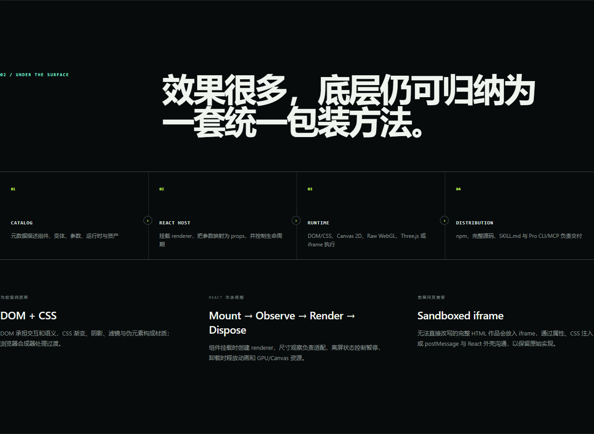

# ThreeUI

> ThreeUI 的核心价值不是发明一套新图形引擎，而是把已经完成的创意视觉实现整理成可预览、可调参、可安装、可复制源码的 React 视觉资产。


## 项目信息

| 字段 | 内容 |
| --- | --- |
| 研究编号 | `003` |
| 上游仓库 | [`MengTo/threeui`](https://github.com/MengTo/threeui) |
| 研究基线 | commit [`68802d5`](https://github.com/MengTo/threeui/tree/68802d5428071ada5c20db8094b1649e6bb770ed)，npm `@designcodeio/threeui@1.2.0` |
| 上游许可证 | [MIT](https://github.com/MengTo/threeui/blob/68802d5428071ada5c20db8094b1649e6bb770ed/LICENSE)；字体、第三方运行时和远程预览另见上游声明 |
| 研究状态 | `validated` |
| 首次研究 | `2026-09-03` |
| 最近更新 | `2026-09-03` |
| 标签 | `react`, `three.js`, `webgl`, `canvas`, `ui-components`, `shaders`, `agent-skills` |

## 为什么值得研究

高质量网页视觉的难点往往不在“能不能写出一个 shader”，而在如何把实验变成团队可用的产品资产：如何发现、预览、配置、导入、复制源码、处理尺寸变化、暂停离屏渲染、释放资源，并在不同图形技术之间保持接近的使用体验。

ThreeUI 把这些问题同时放进一个组件目录和分发链路里。它因此更像“视觉零件仓库 + 交付系统”，而不是单一 UI 套件或网页生成器。

## 研究问题

- [x] Community 版包含哪些能力，是否只有 Three.js？
- [x] Raw WebGL、Canvas 2D、Three.js 与 DOM/CSS 组件的底层路径有何区别？
- [x] React 包装层如何处理参数、尺寸、动画与资源生命周期？
- [x] 它适合在哪些页面位置使用，生产集成的风险在哪里？
- [x] 它和我们研究的 Kage / 优秀网页生成方向是什么关系？

## 结论摘要

- **已验证：** npm 包暴露根入口、样式入口、按组件子路径和静态资产子路径；Demo 通过按组件 `lazy import` 使用了 13 个真实上游组件，覆盖五类能力，而不是临摹效果。
- **已验证：** 浏览器探针分别观察到 `webgl`、`2d`、`webgl2` context；切换到 DOM/CSS 案例后页面中没有 Canvas，中央控件仍是可聚焦、可点击的原生 `button`。
- **已验证：** 实时 renderer 在 React effect 中建立运行时，并用 `ResizeObserver`、`IntersectionObserver`、`requestAnimationFrame` 与清理函数管理尺寸、离屏暂停和释放；完整作品则保留在 iframe 沙箱中。
- **已验证：** 逐项等待稳定态并复核 13 张舞台截图后，修复了旧 Constellation 的近黑空态和 Brand Orb 的过小展示；当前 13/13 项都有肉眼可辨内容和“已就绪”状态。
- **已验证：** 舞台具备加载、慢初始化、失败、重试四态。阻断 Kage 资源会进入“重新加载”，解除阻断后可恢复并完成页面预载。
- **已验证：** 概念产品 KAGE STUDIO 把 7 个真实组件实例编排为 `signal → system → identity → proof` 四幕完成态产品叙事；这证明库能力可以服务同一页面目标，而不只是被逐项预览。
- **已验证：** Our Generation Workflow 把组件接进 Brief→Hero、品牌适配、CTA 接线、浏览器质量门禁和 Kage 模板迁移五个实际任务。当前为 3 项 `PASS`、2 项 `CONDITIONAL`；质量门禁通过是宿主 DOM 检查的结论，Gauge 本身没有数据 API 的限制仍然保留。
- **已验证：** Liquid Hero 的长文案压力、preset 和静态降级均通过；Circle Buttons 的真实 `onClick` 更新了宿主状态；Performance Gauges 则确认没有 `value/range/onChange`，不能直接承担业务图表。
- **已验证：** 当前上游 README 声称 50 个父组件、111 条路由和 164 个浏览结果，但同一基线的机器同步报告记录 43、104、163。Demo 因此明确以机器报告为口径，完整列出其 43 个父条目、163 个具名变体和 13 个单例组件。
- **推断：** ThreeUI 真正可复用的不是某个视觉风格，而是“目录元数据 → 参数化 React 壳 → 多运行时 renderer → npm/源码/Skill/CLI”的资产产品化方法。
- **评价：** 它很适合作为优秀网页生成系统的效果供应层，却不能替代页面级的内容理解、信息架构、审美判断、组合策略和质量评估。

## 能力地图

| 能力层 | ThreeUI 提供什么 | 本 Demo 的证明 | 适合场景 |
| --- | --- | --- | --- |
| 发现与理解 | 分类浏览、搜索、详情页、实时预览、参数说明、变体 | 43 项完整可搜索索引，展开可看变体与控制键 | 技术选型、视觉探索、快速比较 |
| React 组件 | props 参数、CSS 包装、生命周期、类型声明 | 13 个组件从 npm 子路径直接加载 | Hero、背景、按钮、数据氛围、局部互动、整页作品 |
| 多渲染栈 | Raw WebGL、Canvas 2D、Three.js、DOM/CSS/SVG、iframe | 13 个跨五类案例逐一挂载实测 | 从轻量控件到 GPU 像素效果、三维场景和整页叙事 |
| 分发与复用 | npm 包、完整 Community 源码、资产、来源说明；Pro 另有 CLI | 锁定 `1.2.0`、包构建和静态部署 | 团队组件库、Agent 工具箱、设计工程协作 |
| 工程边界 | 离屏暂停、响应式 resize、资源 dispose、资产路径与加载恢复 | 切换时只保留当前 renderer；无 WebGL 有 DOM fallback；失败案例可重试 | 生产集成前的可靠性基础 |

详细实现与扩展方向见 [`capability-map.md`](capability-map.md)。

## 底层原理

### 1. 目录层：先把视觉作品描述成数据

组件条目携带 id、变体、控制参数、技术标签、预览和源码入口。目录并不负责绘制，但它让“发现一个效果、理解它能调什么、把它带走”成为稳定流程。上游的 [`community-sync-report.json`](https://github.com/MengTo/threeui/blob/68802d5428071ada5c20db8094b1649e6bb770ed/public/community-sync-report.json) 还记录每个 Community 条目的变体与控制键，用于检查公开边界和同步完整性。

### 2. React 包装层：把命令式 renderer 变成声明式组件

实时图形通常依赖命令式资源：canvas context、shader program、buffer、scene、camera、animation frame。ThreeUI 的组件在挂载时创建它们，把最新 props 保存在 ref 中供渲染循环读取，并在卸载时取消帧循环、断开 observer、删除 WebGL 对象或调用 renderer `dispose()`。

共同生命周期可以归纳为：

```text
props / catalog metadata
          ↓
React component mounts
          ↓
create renderer → resize → frame loop
          ↑                     ↓
   props ref updates      visibility pause
          └──── unmount → cancel / dispose
```



### 3. 渲染层：不是一条技术路线，而是四条

- **Raw WebGL：** [`LiquidFormBackground`](https://github.com/MengTo/threeui/blob/68802d5428071ada5c20db8094b1649e6bb770ed/src/shaders/liquid-form/LiquidFormBackground.tsx) 自己编译顶点/片元 shader、创建全屏四边形 buffer，并逐帧更新分辨率、时间、指针和材质 uniform。CPU 负责状态与命令，GPU 并行决定像素颜色。
- **Canvas 2D：** [`condensationRenderer`](https://github.com/MengTo/threeui/blob/68802d5428071ada5c20db8094b1649e6bb770ed/src/shaders/condensation/condensationRenderer.ts) 在 JavaScript 中维护水滴生长、下落、合并和涟漪；预渲染不同尺寸的水滴精灵到缓存 Canvas，再逐帧合成。
- **Three.js：** [`orbitalSphereRenderer`](https://github.com/MengTo/threeui/blob/68802d5428071ada5c20db8094b1649e6bb770ed/src/shaders/orbital-sphere/orbitalSphereRenderer.ts) 使用 Scene、PerspectiveCamera、BufferGeometry、Points、Line 和 Mesh 组织 15,000 个候选点及轨道。Three.js 简化场景管理，最终仍调用 WebGL。
- **DOM + CSS：** [`CircleButtons`](https://github.com/MengTo/threeui/blob/68802d5428071ada5c20db8094b1649e6bb770ed/src/shaders/circle-buttons/CircleButtons.tsx) 用真实按钮语义、SVG 和 CSS 渐变/阴影/滤镜形成质感；它保留键盘和可访问性语义，不需要 Canvas。

### 4. 分发层：组件、样式和资产分开交付

[`package.json`](https://github.com/MengTo/threeui/blob/68802d5428071ada5c20db8094b1649e6bb770ed/package.json) 通过 exports 同时暴露根入口、`style.css`、`components/*` 和 `assets/*`。本 Demo 对 13 个案例采用按组件子路径动态导入：主界面与各 renderer 分块构建，重型 Three.js 和 iframe 组件只在用户选择时下载和执行。

完整 HTML 作品需要把 `lib-dist/assets` 中的运行文件复制到应用 public 目录，或通过组件的 `sourceUrl` / `assetBaseUrl` 改写路径。这种方案保真度高，但引入 iframe、路径、跨域、通信和第三方素材边界。

## 与 Kage / 优秀网页生成研究的区别

两者位于同一条链路的不同层：

| 研究方向 | 主要回答的问题 | 主要产物 | ThreeUI 与它的关系 |
| --- | --- | --- | --- |
| Kage / 优秀网页生成 | 面对一个目标，怎样决定叙事、内容结构、版式、风格、动效和页面组合？ | 新页面、生成流程、审美与评估规则 | 决定“为什么这样设计、怎样组合成完整体验” |
| ThreeUI | 一个已经做好的视觉实验，怎样被发现、调参、复用和交付？ | 参数化组件、目录、源码、资产、安装链路 | 提供“可被选择和编排的高级视觉零件” |

因此，ThreeUI 不是 Kage 研究的替代品，而是可接入其中的能力层。理想组合是：生成系统先理解目标并制定页面结构，再从类似 ThreeUI 的目录中检索合适效果，生成参数和内容映射，最后用性能、可读性、可访问性规则验收成品。

## 实际使用场景与探测结论

真实价值不是“看见 renderer 已经挂载”，而是知道它进入我们的网页生成链路以后，内容、品牌、事件、浏览器验收与模板治理是否仍然成立。本研究把五项探测连成 `Brief → Candidate → Brand → Events → Browser Gate → Template`：

| 使用场景 | 运行探测 | 结果 | 有界结论 |
| --- | --- | --- | --- |
| Brief → Hero | Liquid Form + 可索引 DOM；选择三类项目 brief，切换 Calm/Kinetic、长文案与 fallback | 创意工作室 preset 更新标题/正文/CTA；1 Canvas；fallback 后 0 Canvas、2 CTA 保留 | `PASS`：结构化 brief 可以驱动内容与视觉参数，但必读内容不能进入 Canvas |
| 品牌适配 | Brand Orbs 在 Codex/Figma/React 间预览，并点击 Apply 写回宿主 | Figma preset 可见；回执更新为已应用；1 Canvas iframe | `CONDITIONAL`：协议成立；真实项目需换自有资产并处理商标与 iframe 边界 |
| CTA 接线 | Circle Buttons 切换 variant，并把生成候选送入浏览器验收 | 1 原生 button；交接计数 `00 → 01`；ARIA/onClick 可用 | `PASS`：视觉组件可以进入生成、发布或回滚的宿主状态 |
| 浏览器质量门禁 | 宿主读取当前舞台的水平溢出、语义标题、控件与视觉实例；Gauge 只作氛围 | `PENDING → PASS`；0 溢出、1 标题、1 控件、1 iframe | `PASS`：DOM 检查可用；Gauge 无 value API，不能冒充检测结果 |
| Kage 模板迁移 | Kage URL iframe 运行完整页面，切换宿主字体/主色 | 1 iframe；Editorial preset 生效；本地资产约 3.52 MB | `CONDITIONAL`：适合页面基座；内容槽位、路由、SEO、数据、焦点和资源需桥接 |

探测台还实时输出一份最小能力协议：`workflow + brief + role + component + runtime + preset + appliedBrand + enhancement + observed + audit + verdict`。这使“选用一个效果”从审美猜测升级为可查询、可运行、可验收的生成决策。

### 已实际触发的扩展方向

1. **内容安全区：** Hero 的长文案开关真实改变标题长度，并验证 CTA 与舞台边界。
2. **参数 preset：** Brief/Hero、Brand、CTA、Gauge 与 Kage 都有可切换的受控 preset。
3. **运行时降级：** 关闭增强、reduced-motion 和无 WebGL 都会卸载高成本 renderer，保留 DOM 产品层。
4. **宿主状态协议：** Brand Apply 与 Circle Buttons `onClick` 已进入外层 React 状态；同样的包装可扩展到 loading/success/error、发布与 analytics。
5. **视觉预算调度：** 探测台只挂载当前场景，离开整个 workspace 即卸载 renderer；实例数在报告中实时显示。
6. **iframe 生产治理：** Gauge 与 Kage 的 CDN、路径、通信和沙箱问题由运行态直接暴露，成为迁移任务而不是隐含风险。
7. **浏览器质量门禁：** 当前页面已经运行一次真实 DOM audit；下一步可以把同一协议接入 Playwright 多视口、性能与可访问性检查。

## 从素材库到产品组合验证

在实际场景探测之外，Demo 仍保留明确标注为概念产品的 **KAGE STUDIO**，用于验证多个 renderer 能否形成一致叙事。它是组合证据，不再承担生产可用性结论；真实价值以前一节的场景探测为准。

| 产品场景 | 叙事职责 | 组合能力 | 为什么这样用 |
| --- | --- | --- | --- |
| Signal | 第一眼建立品牌信号并给出进入动作 | Liquid Form + Circle Buttons | shader 负责氛围，原生 button 负责可操作入口 |
| System | 解释生成结果背后是有约束的系统 | Orbital Sphere | 有结构的轨道视觉对应“决策系统”，不替代正文 |
| Identity | 展示同一系统可形成不同品牌表达 | 3 × Brand Orbs | 多实例在同一信息目标下形成对照，而非效果堆叠 |
| Proof | 收束为可交付、可验证的结果 | Semantic Bloom | 动态文字成为证明氛围，交付清单仍由 DOM 承载 |

这次组合验证把结论推进了一步：ThreeUI 可以作为上层开发的视觉基座，但“成品感”并不来自组件数量。真正的上层价值来自内容层级、视觉选型、场景导演、状态映射、性能预算与降级验收。ThreeUI 提供 renderer；Kage / 生成层决定何时用、组合什么、让它服务哪条产品叙事。

演示支持四个语义 tab、方向键、上一幕/下一幕和自动播放，手动操作会立即接管导演状态。核心标题、说明、指标和证明项始终保留在 DOM；离开视口时卸载当前 renderer，reduced-motion 禁用自动播放，无 WebGL 时 Signal/System 切换为 CSS 静态场景。这些约束使它成为一段可评估的产品案例，而不只是最佳状态截图。

## 实验与验证

| 验证问题 | 方法 | 结果 | 证据 | 限制 |
| --- | --- | --- | --- | --- |
| npm 包能否独立使用 | 固定 `@designcodeio/threeui@1.2.0`，TypeScript + Vite 生产构建 | 通过；121 个模块转换完成 | [`apps/003-mengto-threeui/package.json`](../../apps/003-mengto-threeui/package.json) | 未覆盖 Pro 源码 |
| 能力广度是否完整可见 | 固定机器报告数据，展开、搜索和分类索引 | 43/43 父条目、163 个具名变体；`brand` 搜索为 1 项；按钮类为 6 项 | [完整索引截图](assets/screenshots/community-index.png) | 索引展示全部元数据，不逐一运行 163 个变体 |
| 多类别案例是否真实运行 | Chromium 151 逐一切换 13 个 tab，等待就绪并检查稳定截图、像素差异、Canvas、WebGL、DOM 和 iframe | 13/13 达到非空稳定画面；Kage 子文档含 4 个 Canvas 和 2604 字符文本 | [生长树](assets/screenshots/generative-tree-live.png)、[品牌球](assets/screenshots/brand-orbs-live.png)、[Kage](assets/screenshots/kage-live.png) | 每类选择代表案例，不等于全部变体性能背书 |
| 四条底层路径是否可验证 | 记录 canvas context、DOM 控件和 iframe 子文档 | 观察到 `webgl`、`2d`、Three.js WebGL、零 Canvas DOM、srcDoc 与 URL iframe | 浏览器运行时探针 | 部分路径共享浏览器合成与 GPU |
| 交互是否生效 | 改动三条 range，触发 Circle button，方向键切换 tab | 输出更新为 `35 / 1.4× / 284°`；click 回执和键盘切换正确 | Demo 交互探针 | 未做完整辅助技术人工审计 |
| 响应式是否可用 | 1440×900、1024×768、390×844 | 无横向溢出；手机 tab 176×66px | [手机截图](assets/screenshots/runtime-atlas-mobile.png) | 未覆盖全部实机 GPU |
| 降级是否保留信息 | 模拟 `prefers-reduced-motion` 和 WebGL context 创建失败 | 自动导览禁用、标记 `PAUSED`；出现可读 fallback | [`design-contract.md`](design-contract.md) | 无 WebGL 为自动模拟 |
| 加载失败能否恢复 | 阻断 Kage 页面直到 18 秒超时，再解除阻断并触发重新加载 | `仍在初始化 → 重新加载 → 已就绪`；Kage preloader 完成 | 浏览器故障注入探针 | 当前自动重试需用户点击 |
| 多种能力能否构成完成态产品 | 逐幕检查 KAGE STUDIO 四个场景，测试 tab、方向键、Circle button、自动播放、手机与两种降级 | 4/4 稳定；7 个真实组件实例；自动播放约 20 秒停在 Proof；390px 无横向/舞台溢出；reduced-motion 与无 WebGL 仍保留 DOM 内容 | [`design-contract.md`](design-contract.md) 与组合演示浏览器探针 | 概念页验证前端表达，不宣称真实生成后端 |
| 我们的生成链路是否成立 | 逐项运行 Brief/Hero、Brand、CTA、Browser Gate、Template，检查 renderer、preset、状态回写、DOM audit 和 iframe | 5/5 挂载；3 PASS / 2 CONDITIONAL；每项无舞台布局溢出 | Our Generation Workflow 浏览器探针与 [`design-contract.md`](design-contract.md) | verdict 只覆盖本次组件、浏览器和固定版本 |
| 扩展方向是否能被执行 | 触发 brief 映射、长文案、视觉层开关、Brand Apply、CTA callback、DOM audit 与离屏调度 | 创意工作室内容生效；Hero fallback 后 0 Canvas、2 CTA；Brand Apply 回执；CTA `00 → 01`；Gate `PENDING → PASS` | 实时 manifest、telemetry 与浏览器交互证据 | 尚未把协议接入真实 Kage Agent 选择器或后端 |
| 实际场景跨表面是否可用 | 1280、1024、390、键盘与静态 fallback | 三尺寸无横向溢出；五场景无舞台溢出；tab 方向键同步焦点；390px tab 最小约 97px；fallback 保留内容与控制 | Our Generation Workflow 浏览器矩阵 | Gauge 原作仍有 Tailwind CDN 警告；本轮未重跑真实移动 GPU |
| 断网时是否空白 | 阻断全部非本地 HTTP(S)，复测六个 iframe 代表案例 | Tree、Bloom、Brand、Kage 无错误；Gauges、Toggle 有上游 CDN 请求错误但核心画面仍可见 | 离线逐例截图与像素探针 | 后两项不是完全离线，生产仍应自托管依赖 |
| 依赖与构建安全 | `npm audit --audit-level=low`、`npm run build` | 0 个已知漏洞；构建通过 | Demo README 的构建记录 | 审计结果会随 advisory 更新 |

浏览器控制台没有应用错误；逐例稳定等待没有网络失败。完整快速切换矩阵在离开 Performance Gauges 时记录 3 个未完成 Iconify 装饰图标请求被主动终止。Headless Chromium 还报告 WebGL `ReadPixels` stall；Gauges 与 Skeuomorphic Toggle 的上游 iframe 原作报告 Tailwind CDN / GSAP target 警告，Kage 报告同源脚本沙箱组合警告。断网测试证明前两项会丢失远程增强但不会变成空白，也说明完整 HTML 资产离生产级自托管和依赖治理仍有距离。

## 优点与局限

### 优点

- 一个目录覆盖多种浏览器渲染技术，避免团队把“高级视觉”误等同于 Three.js。
- Community 源码、npm、类型声明、资源许可证和按组件入口共同降低复用成本。
- 多数实时组件已经包含 resize、离屏暂停和资源释放，比直接复制 CodePen 更接近可集成状态。
- 参数模型天然适合设计工具、Agent 或配置面板调用。

### 局限

- 它主要管理视觉组件，不负责业务信息架构、内容策略和完整网站生成。
- 组件质量与性能不是天然一致；不同效果可能依赖 Raw WebGL、`three128`、`three165`、当前 peer `three` 或完整 HTML 资产。
- 当前历史 Three.js 共享生产块为 `504.76 kB`（gzip `125.74 kB`），虽已懒加载，仍需按场景衡量网络和 GPU 成本；Kage 本地页面及媒体资产约 `3.52 MB`。
- 完整 HTML 组件的根路径、iframe 通信、CORS、远程媒体和第三方资产需要额外工程处理。
- README 与同步报告的目录数量不一致，自动化消费者应以机器报告和实际 exports 为准，并固定版本。
- 本研究未购买或验证 Pro，所有结论只覆盖公开 Community 包。

## 可扩展方向

1. **结构化能力协议：** 为每个效果补齐 runtime、cost、input、fallback、content-safety、a11y 与 asset-policy 字段，使 Agent 能可靠选择。
2. **预算化运行时：** 加入包体、首帧、CPU/GPU 时间、显存、DPR 上限和多效果并存预算，而不只显示 FPS。
3. **生成系统适配器：** 把自然语言目标映射到组件 id、变体和参数，再生成可审核的 React 组合代码。
4. **统一降级层：** 为 WebGL/Canvas 效果配套静态海报、低功耗模式、reduced-motion 方案与错误边界。
5. **内容感知组件：** 将标题长度、对比度安全区、交互热点和响应式构图作为参数约束，让效果更容易承载真实业务内容。
6. **版本隔离和依赖治理：** 收敛多 Three.js 版本，或为历史 renderer 明确独立 chunk / worker / iframe 边界。
7. **视觉回归与实机矩阵：** 为关键组件建立固定种子、截图差异、帧时间分位数和移动 GPU 验收。

## 对我们的意义

对你的 Kage / 优秀网页生成研究，ThreeUI 最重要的意义不是“又找到一批炫酷效果”，而是证明高级视觉可以成为生成系统中的结构化、可调用资产。

| 时间尺度 | 对你的具体价值 | 应该吸收什么 | 不应误解为什么 |
| --- | --- | --- | --- |
| 现在 | 用 5 个实际任务把能力分成直接可用、条件可用和受限，不再只按视觉吸引力判断 | Community renderer、公开 API、运行探测和 verdict | 直接把示例或概念组合当成完成的业务页面 |
| 下一阶段 | 建立统一效果注册表，让 Agent 能按真实探测结果查询和选择 | id、runtime、role、inputs、cost、fallback、license、observations、verdict | 收集越多效果，生成质量就自然越高 |
| 长期 | 把审美判断和工程验收转成系统能力 | 内容安全区、设备预算、组合约束、视觉回归和浏览器门禁 | ThreeUI 会自动理解品牌、内容或叙事目标 |

它在整体链路中的位置应当是：

```text
Brief / 业务目标
        ↓ 受众、内容、品牌、设备预算
Kage Planner / 生成与编排
        ↓ 叙事、信息架构、版式、视觉槽位
ThreeUI Registry / 视觉资产层
        ↓ effect id、variant、validated props、runtime、fallback
Browser Quality Gate / 质量验收
        ↓ 可读性、响应式、性能、降级、回归
可交付页面
```

因此行动顺序也很明确：

1. **P0 — 扩大使用探测：** 把当前五个场景的能力协议和 verdict 扩展到其余 13 个代表组件。
2. **P1 — 接入 Kage 选择器：** 让 Kage 输出视觉槽位与约束，由 registry 按场景、预算和历史 verdict 返回候选组件。
3. **P2 — 自动重跑浏览器门禁：** 在库升级后重复长文案、移动端、reduced-motion、WebGL 降级、资源失败和帧时间探测。

短期收益是少写一批效果代码；长期收益是把“什么时候该用什么效果，以及怎样证明它真的可用”变成我们的生成系统能力。

## 展示素材

### 封面


- **画面说明：** 自制 ThreeUI Runtime Atlas 首屏；左侧给出 43 / 163 / 13 的范围，右侧直接运行 npm 包中的 Liquid Form，并显示多案例入口。
- **研究意义：** 同一屏同时呈现能力规模、当前视觉效果和运行时，避免把四条底层路径误解为只有四种效果。
- **来源与权利：** 展台代码自制；Liquid Form 来自 ThreeUI Community，MIT。
- **生成或截取日期：** `2026-09-03`

更多素材说明见 [`assets/README.md`](assets/README.md)。

## Web Demo

- 源码：[`apps/003-mengto-threeui/`](../../apps/003-mengto-threeui/)
- 在线地址：<https://yydshly.github.io/0902_codex_project/demos/003-mengto-threeui/>
- 验证边界：完整展示机器报告的 43 个 Community 父条目和 163 个具名变体元数据，真实运行其中 13 个跨类别代表案例，并对网页生成链路的 5 个任务做 3 PASS / 2 CONDITIONAL 探测；不覆盖 Pro，也不等于逐一验证 163 个变体的生产性能。

## 来源与相关链接

- [上游仓库](https://github.com/MengTo/threeui)
- [固定基线 README](https://github.com/MengTo/threeui/blob/68802d5428071ada5c20db8094b1649e6bb770ed/README.md)
- [npm 包定义与 exports](https://github.com/MengTo/threeui/blob/68802d5428071ada5c20db8094b1649e6bb770ed/package.json)
- [Community 同步报告](https://github.com/MengTo/threeui/blob/68802d5428071ada5c20db8094b1649e6bb770ed/public/community-sync-report.json)
- [第三方声明](https://github.com/MengTo/threeui/blob/68802d5428071ada5c20db8094b1649e6bb770ed/THIRD_PARTY_NOTICES.md)
- [资产许可证](https://github.com/MengTo/threeui/blob/68802d5428071ada5c20db8094b1649e6bb770ed/ASSET-LICENSES.md)

## 变更记录

- `2026-09-03`：建立研究条目，固定 npm 与源码基线，完成四运行时原理样本、浏览器验证和能力判断。
- `2026-09-03`：根据“只展示四种效果”的反馈扩展为 13 个实时案例、五类能力与 43/163 完整索引，并重跑桌面、移动、键盘、reduced-motion 与无 WebGL 验证。
- `2026-09-03`：根据“内部有的打不开”的反馈改为逐项稳定画面验收；用自包含 Generative Tree 替换近黑且依赖外网的 Constellation，放大并列展示三种 Brand Orb，加入加载/超时/重试状态，并完成在线、离线和故障恢复验证。
- `2026-09-03`：新增页面内“对我们的意义”、四段集成蓝图与 P0/P1/P2 行动顺序；明确 ThreeUI 是 Kage 生成层下游的视觉资产 registry，不是页面生成器本身，并通过 1440/1024/390px 与键盘锚点验证。
- `2026-09-03`：根据“应以产品最终效果为目标”的反馈新增 KAGE STUDIO 四幕组合演示；用 Liquid Form、Circle Buttons、Orbital Sphere、三种 Brand Orbs 与 Semantic Bloom 服务同一产品叙事，并完成导演控制、离屏卸载、移动端、reduced-motion 和无 WebGL 验证。
- `2026-09-03`：根据“真实价值应来自实际使用场景与可扩展探测”的澄清，新增五场景 Application Probe Lab；实际触发内容压力、参数 preset、静态 fallback、宿主 callback 与单实例调度，并把结果分为 2 PASS / 2 CONDITIONAL / 1 LIMITED，公开记录 Gauge 的数据 API 与 CDN 限制。
- `2026-09-03`：根据“用符合我们场景的实际用例展示”的要求，把通用五场景重构为 Brief→Candidate→Brand→Events→Browser Gate→Template 链路；新增三类 brief、品牌 Apply 回执、生成 CTA 交接和真实 DOM audit，并完成 1280/1024/390px、键盘与 fallback 验证。
