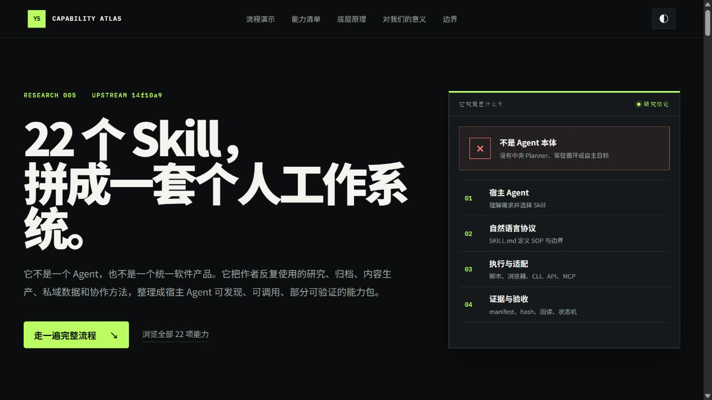

# Yichen Skills

> 研究一个个人工作流如何被拆成二十多个可复用 Skill，并通过路由、脚本、权限闸门和结果验证组成面向 Codex / Claude Code 的能力库。

[](https://yydshly.github.io/0902_codex_project/demos/005-mcncarl-yichen-skills/)

*核心演示图：直接解释 Skill 库不是 Agent 本体，而是由宿主路由、协议、执行器和验收证据组成的工作系统。*

## 项目信息

| 字段 | 内容 |
| --- | --- |
| 研究编号 | `005` |
| 上游仓库 | <https://github.com/mcncarl/yichen-skills> |
| 研究基线 | [`14f10a9`](https://github.com/mcncarl/yichen-skills/commit/14f10a96a719a1d60aa02c582e674d5b197d5861)，2026-09-02 |
| 上游许可证 | [Personal Learning and Non-Commercial Use License](https://github.com/mcncarl/yichen-skills/blob/14f10a96a719a1d60aa02c582e674d5b197d5861/LICENSE) |
| 研究状态 | `validated` |
| 首次研究 | `2026-09-03` |
| 最近更新 | `2026-09-03` |
| 标签 | `agent-skills, workflow-automation, research, content-ops, local-first, safety` |

## 一句话结论

Yichen Skills 不是 Agent，也不是一个独立运行的产品；它是作者把个人研究、内容生产、社交平台归档、私有数据处理和知识管理 SOP 封装成的多 Skill 能力库。它最值得研究的不是具体平台脚本，而是如何把个人经验表达成“可触发、可路由、可授权、可执行、可验证”的 Agent 工作协议。

## 为什么值得研究

普通 Skill 仓库往往只提供提示词或几条命令。Yichen Skills 同时出现了四种资产：

1. `SKILL.md`：定义触发条件、流程、边界和完成标准；
2. `scripts/`：用 Python、Node、Playwright、FFmpeg、SQLite 等执行确定性工作；
3. `references/`：保存协议、数据结构、平台限制和故障处理；
4. `tests/` 与 CI：验证路由、覆盖保护、凭据处理和结构契约。

这让它成为“个人工作经验如何工程化为 Agent Skills”的完整样本，也展示了 Skill 与 Agent 的边界：Agent 负责理解目标、决策和综合；Skill 提供专项操作协议；脚本、MCP 和外部 CLI 才是实际工具。

## 研究问题

- [x] 仓库包含哪些 Skill、插件和兼容入口？
- [x] 哪些能力是提示词协议，哪些包含真实执行器？
- [x] 搜索、归档、转写、内容生产和知识沉淀如何组合？
- [x] 权限、凭据、覆盖保护和成功验证如何设计？
- [x] 哪些模块依赖外部服务、登录态或未公开 Runtime？
- [x] 当前代码和测试对 Windows 的支持程度如何？
- [x] 哪些设计可以迁移到我们的 Skill 体系？
- [x] 商业与公司内部使用受到什么许可限制？

## 结论摘要

- **已验证：** 基线包含 22 个 `SKILL.md`，其中包括 21 个根级 Skill 和 Grok 插件内的 1 个 Skill；`yichen-social-bookmarks-exporter` 已退役，仅作兼容转发。
- **已验证：** 仓库不是单一 Agent。Codex、Claude Code 或 ChatGPT 是执行与决策主体；Skill 负责向这些 Agent 注入领域流程、约束和工具使用方法。
- **已验证：** 仓库有 84 个 Python/Node 源文件和 30 个测试/fixture 文件，不是单纯的提示词集合。
- **已验证：** 最完整的能力链是互联网研究家族：`web-research → unified-search → content-archive / bookmarks-export → asr`，通过候选 envelope 和 handoff contract 分离发现、读取、下载和私人数据授权。
- **已验证：** X Article、X Slicer、研究家族和 Windows 微信读取器具有较强的程序性验证；`summary`、`video-content`、`jianying-editor` 更接近 Agent SOP 或分析模板。
- **已验证：** `agent-memory` 的核心实现位于另一个仓库；`yichen-codex-chatgpt` 不分发其私有 Tunnel/MCP Runtime；Step ASR、公众号增强导出和部分搜索路线也依赖外部安装。
- **已验证：** 本地 Windows 运行 367 个测试项，354 通过、1 跳过、12 失败或加载错误；失败主要暴露 POSIX 权限/路径假设和未安装可选依赖，不能据此证明所有业务逻辑有缺陷，但说明跨平台路径尚未完全收敛。
- **已验证：** 根 README、CI 路径与最近一次 `codex-chatgpt → yichen-codex-chatgpt` 重命名存在不同步，说明当前主分支仍在快速整理期。
- **评价：** 它适合个人非商业工作流和设计参考，不宜在未经授权、未做安全与兼容加固时整包进入企业生产环境。

## 能力全景

### 1. 研究与信息获取

- `yichen-web-research`：跨阶段研究总路由与横纵研究协议。
- `yichen-unified-search`：网页与多个内容平台的公开候选发现、归一化和轻量核验。
- `yichen-content-archive`：读取、下载、归档已知 URL 或已确认有限容器。
- `yichen-bookmarks-export`：当轮授权后导出小红书、抖音、X 私人收藏链接。
- `yichen-chatgpt-web-research`：控制用户已登录的 ChatGPT 官网完成研究并保存结果。
- `yichen-grok-consult`：通过 MCP 调用 Grok 做 X 搜索、独立回答、审查和反驳。

### 2. 音视频与内容生产

- `yichen-asr`：在 Step ASR 与豆包 ASR 之间按输出需求路由。
- `yichen-volc-asr`：转写、时间戳、SRT、口播删留和 FFmpeg 粗剪。
- `yichen-video-content`：对标视频的 13 模块内容拆解和逐句作用分析。
- `yichen-jianying-editor`：剪映/CapCut 桌面精修操作 SOP。
- `yichen-x-article-draft-uploader`：把 Markdown 上传为 X Article 草稿并回读验证。
- `yichen-x-slicer`：把一个 X Post/Thread 转成 3:4 图片序列、ZIP 和视频。

### 3. 私有数据与平台操作

- `yichen-wechat-local-vault`：Mac 微信数据库解密、查询、导出和群聊素材包。
- `yichen-wechat-windows-reader`：只读分析用户提供的 Windows 微信明文静态快照。
- `yichen-wechat-mp-batch-exporter`：公众号文章、历史、原创筛选、指标和评论归档。
- `yichen-wecom-local-vault`：Mac 企业微信数据库密钥捕获、快照、查询和导出。
- `yichen-wecom-operations`：通过官方 CLI 操作企微文档、待办、会议和日程。
- `yichen-mac-wechat-dual-open`：复制、改 bundle id、重签名，创建第二个 Mac 微信实例。

### 4. 记忆与知识沉淀

- `yichen-summary`：把当前对话整理为 Obsidian Markdown。
- `yichen-agent-memory`：安装和运维独立的 Agent Memory Vault，以 Markdown 为事实源，SQLite/FTS 和可选 Zvec 为索引。
- `yichen-social-bookmarks-exporter`：已退役兼容名，只转交 `yichen-bookmarks-export`。

逐模块输入、输出、依赖、实现层级和边界见 [`notes/module-inventory.md`](notes/module-inventory.md)。

## 架构速览

```text
用户目标
  │
  ▼
Codex / Claude Code / ChatGPT                 Agent：理解、决策、综合
  │ 读取 name / description
  ▼
SKILL.md                                      Skill：触发、SOP、边界、验收
  │
  ├─ references/                              协议、schema、平台限制
  ├─ scripts/                                 Python / Node 确定性执行
  ├─ MCP / 外部 CLI                           远程模型、搜索、平台能力
  └─ Browser / Playwright / FFmpeg / SQLite   实际运行时
  │
  ▼
Envelope / manifest / receipt / hash / QA     可检查的证据
  │
  ▼
Agent 读取证据并交付结果
```

详细分层、信任边界、状态机与数据契约见 [`notes/architecture.md`](notes/architecture.md)。

## 关键设计模式

### Skill 不是 Agent

仓库不包含一个统一自主运行、持续感知环境并自行追求目标的 Agent。它依赖宿主 Agent 读取 `SKILL.md`、选择路线并调用工具。即使 `yichen-codex-chatgpt` 编排两个 Agent，它自身仍然只是协作协议。

### 路由器与执行器分离

`yichen-web-research` 和 `yichen-asr` 不发明新的搜索或识别引擎，而是根据意图和能力选择子 Skill/后端。这样可以替换执行器，同时保持用户意图、安全边界和交付结构稳定。

### 发现、读取、下载、写入分权

搜索只产生候选；打开原文不自动证明主张；收藏导出不自动取得下载授权；归档不会为了补数量继续搜索。这种“授权不可转移”是仓库最值得迁移的安全原则。

### 搜索候选不是事实

统一搜索把结果映射为包含 `candidate_id`、后端、时间、核验状态、来源、覆盖限制和错误的 envelope。标题、摘要、AI 生成摘要和排名都只作为候选元数据，正式引用仍需打开原始来源并核对具体主张。

### Fail closed 与结果证据

多个模块规定：证据缺失时停止或降低结果状态，不能靠 Agent 自述成功。例如 X Article 必须重载同一草稿并核对正文、表格和媒体；X Slicer 要验证图片尺寸、文本覆盖、ZIP hash、视频解码和音频区间；Windows 微信读取器要求静态快照、schema、SQLite 完整性与只读连接全部通过。

### Local-first 但不是完全离线

敏感数据库、明文快照、密钥文件和工作产物倾向保留在本机；同时搜索词、媒体或提示会按具体路线发送给 AnySearch、Firecrawl、xAI、火山引擎等服务。Local-first 代表数据边界优先本地，不代表所有能力零联网或零第三方保留。

## 典型组合场景

### 创作者内容链

```text
选题研究 → 多平台候选 → 已确认素材归档
         → 视频 ASR → 对标逐句分析
         → X 图片/视频切片或长文草稿
         → Obsidian / Memory Vault 沉淀
```

### 私人数字资产链

```text
当轮授权 → 收藏链接导出 / 微信或企微本地快照
         → 有界查询和 Markdown 导出
         → 人工确认后的摘要、客户跟进或知识沉淀
```

### 双 Agent 代码协作链

```text
ChatGPT Pro 研究和 PLAN
  → Codex 独占本地修改与测试
  → ChatGPT 通过只读 MCP REVIEW
  → DONE / 一次修复 / BLOCKED
```

更多适用和不适用场景、扩展路线以及对本项目的意义见 [`notes/use-cases-and-roadmap.md`](notes/use-cases-and-roadmap.md)。

## 实验与验证

| 验证问题 | 方法 | 结果 | 证据 | 限制 |
| --- | --- | --- | --- | --- |
| 上游版本是否固定 | 浅克隆主分支并记录 HEAD | `14f10a9` | 本页研究基线 | 上游后续提交不在结论范围内 |
| 是否不只是提示词 | 统计跟踪文件、Skill、源码和测试 | 22 个 Skill 文件、84 个 Python/Node 文件、30 个测试/fixture 文件 | [`experiments/repository-audit.md`](experiments/repository-audit.md) | 文件数量不等于运行质量 |
| 研究家族能否离线验证 | 运行 `validate_family.py` | Windows 下 `ok: false` | [`experiments/repository-audit.md`](experiments/repository-audit.md) | 受 OS 权限语义和路径分隔符影响 |
| 核心契约测试状态 | 分目录运行 Python unittest 和 Grok Node test | 367 项中 354 通过、1 跳过、12 失败/错误 | [`experiments/repository-audit.md`](experiments/repository-audit.md) | 未安装所有可选依赖；未执行真实平台 E2E |
| 文档与重命名是否一致 | 比较实际目录、README 和 CI path filters | 存在旧 `codex-chatgpt` 引用 | [`notes/verification-and-risks.md`](notes/verification-and-risks.md) | 可能在后续提交修复 |

## 优点与局限

### 优点

- 以真实个人工作为来源，能力覆盖完整内容生产链，而不是抽象演示。
- 多处明确区分候选、事实、授权、写入和完成，安全意识强。
- 将 AI 判断和机械执行分开，复杂环节尽量由脚本、schema 和 hash 收敛。
- 对输出覆盖、重复计费、跨服务商重提、私人数据泄露等实际风险有具体规则。
- 研究、归档、ASR、内容生产和记忆可以组合，但组合间保留独立授权门。

### 局限

- 高度围绕作者个人平台、路径、账号和内容工作习惯，不是通用 Skill SDK。
- 部分模块只有 SOP，部分模块实现完整，成熟度和可移植性差异很大。
- 浏览器 DOM、非官方 GraphQL、第三方 CLI 和桌面应用自动化容易随平台更新失效。
- 微信/企微主能力偏 macOS；当前研究家族在 Windows 仍有 POSIX 假设。
- `agent-memory`、Step ASR、公众号增强栈和 Codex × ChatGPT 私有 Runtime 并未全部包含在本仓库。
- 缺少统一版本发布、兼容矩阵、全仓端到端测试和集中可观测系统。
- 许可证禁止未经书面授权的公司内部部署、客户交付、付费产品和商业工具包使用。

风险分级和验证细节见 [`notes/verification-and-risks.md`](notes/verification-and-risks.md)。

## 可复用结论

1. **先沉淀 SOP，再决定是否写代码。** 分析模板、操作协议和自动化执行器可以是不同成熟阶段，不必一开始都做成复杂程序。
2. **Skill 的价值是压缩决策空间。** 好 Skill 不只是告诉 Agent 能做什么，还要规定何时不该做、失败后不能换成什么。
3. **把授权设计为一次性、精确、不可转移。** 发现权限、私人读取权限、下载权限和写入权限应该分别取得。
4. **把结果设计为证据对象。** manifest、receipt、hash、checkpoint、coverage 和失败清单比自然语言“已完成”可靠。
5. **路由层应稳定，后端应可替换。** 用户意图不应绑定某个搜索、ASR 或浏览器服务。
6. **提示词安全不是强隔离。** 高风险边界需要脚本校验、只读连接、操作系统权限、沙箱和审计共同实现。
7. **完整能力链比孤立 Skill 更有价值。** 搜索、归档、转写、生产和记忆围绕统一交接结构组合，才能形成工作系统。

## 对我们的意义

如果我们要建设自己的 Skill 库，最值得复制的是方法，而不是这些具体平台能力：

- 盘点团队反复执行的任务，提炼触发条件和最低必要动作；
- 为每个 Skill 明确输入、输出、外部数据流、费用、授权和完成证据；
- 把高确定性的步骤脚本化，把开放判断留给 Agent；
- 用统一 envelope 和 handoff 连接多个 Skill；
- 从只读、低风险流程开始，再开放草稿和外部写入；
- 维护跨平台 CI、版本兼容和运行审计，避免个人脚本直接变成团队生产依赖。

对个人学习而言，这个仓库可以作为成熟样本拆解。对公司或商业项目而言，第一前置项是取得作者明确书面授权；在授权和安全评估完成前，不应把上游代码、文档或衍生 Skill 直接纳入内部工具链。

## 展示素材

本研究不复制上游图片、界面截图或微信赞赏码。素材策略和权利边界见 [`assets/README.md`](assets/README.md)。

## Web Demo

- [在线能力图谱](https://yydshly.github.io/0902_codex_project/demos/005-mcncarl-yichen-skills/)
- [页面源码](../../apps/005-mcncarl-yichen-skills/)

Demo 把 22 项能力、四层架构、实现成熟度、依赖边界和团队采用路线放在同一条可交互阅读路径里。每个 Skill 都有典型场景；流程模拟器进一步用“内容创作、深度研究、私域资产”三类案例展示 Agent 决策、Skill 接力、handoff、安全闸门和最终成果。它只展示固定研究数据与说明性样例，不会运行任何上游 Skill、读取账号登录态或访问私人数据。

## 来源与相关链接

- [上游 README](https://github.com/mcncarl/yichen-skills/blob/14f10a96a719a1d60aa02c582e674d5b197d5861/README.zh.md)
- [上游许可证](https://github.com/mcncarl/yichen-skills/blob/14f10a96a719a1d60aa02c582e674d5b197d5861/LICENSE)
- [研究总路由](https://github.com/mcncarl/yichen-skills/blob/14f10a96a719a1d60aa02c582e674d5b197d5861/yichen-web-research/SKILL.md)
- [统一搜索候选结构](https://github.com/mcncarl/yichen-skills/blob/14f10a96a719a1d60aa02c582e674d5b197d5861/yichen-unified-search/references/candidate-schema.md)
- [内容归档交接结构](https://github.com/mcncarl/yichen-skills/blob/14f10a96a719a1d60aa02c582e674d5b197d5861/yichen-content-archive/references/handoff-contract.md)
- [Codex × ChatGPT Skill](https://github.com/mcncarl/yichen-skills/blob/14f10a96a719a1d60aa02c582e674d5b197d5861/yichen-codex-chatgpt/SKILL.md)
- [Grok 插件清单](https://github.com/mcncarl/yichen-skills/blob/14f10a96a719a1d60aa02c582e674d5b197d5861/plugins/yichen-grok-consult/.codex-plugin/plugin.json)
- [X Article 持久化验证协议](https://github.com/mcncarl/yichen-skills/blob/14f10a96a719a1d60aa02c582e674d5b197d5861/yichen-x-article-draft-uploader/SKILL.md)
- [第三方来源与许可证说明](https://github.com/mcncarl/yichen-skills/blob/14f10a96a719a1d60aa02c582e674d5b197d5861/THIRD_PARTY_NOTICES.md)

更细的主张—来源对应关系见 [`notes/source-ledger.md`](notes/source-ledger.md)。

## 变更记录

- `2026-09-03`：新增三类组合使用场景和七步内容创作流程模拟器，补齐 22 个 Skill 的逐项典型场景与效果展示。
- `2026-09-03`：新增 Yichen Skills Capability Atlas，提供 22 项全量筛选、详情查看、四层原理和团队采用路线。
- `2026-09-03`：固定提交 `14f10a9`，完成全部 Skill/插件能力盘点、架构分析、测试审计、风险判断和扩展路线。
