# 350 Layout Compositions

> 一套把构图、视觉原则、出版、字体网格、网页 UI、影视、中国传统构图和演示页面压缩成 350 张教学海报的静态知识图鉴；它的核心资产是分类词汇与视觉说明，不是自动排版引擎。


## 项目信息

| 字段 | 内容 |
| --- | --- |
| 研究编号 | `006` |
| 上游仓库 | [nevertoday/350-layout-compositions](https://github.com/nevertoday/350-layout-compositions) |
| 研究基线 | [`34dc39cb5128776b594754624fa2202d5942a35b`](https://github.com/nevertoday/350-layout-compositions/tree/34dc39cb5128776b594754624fa2202d5942a35b)（2026-08-31） |
| 上游许可证 | [CC BY 4.0](https://github.com/nevertoday/350-layout-compositions/blob/34dc39cb5128776b594754624fa2202d5942a35b/LICENSE) |
| 研究状态 | `validated` |
| 首次研究 | `2026-09-03` |
| 最近更新 | `2026-09-04` |
| 标签 | `layout, composition, visual-design, taxonomy, dataset, static-gallery` |

## 先说结论

这个仓库做了三件扎实的事：整理 350 个版式名称，把它们放进 8 个一级分类和 33 个二级主题；为每项提供一张 3:4 教学海报；再用 JSON、CSV 和 Python 脚本把素材变成可浏览、可下载、可验证的静态图鉴。

它没有根据任意文章自动生成信息图，也没有内容理解、布局求解、CSS/PPT/Figma 导出或智能推荐。README 中的付费 `xxd-panel-*` Skills 是外部商业产品，不属于这个开源仓库本身。

当前 v2 还有一个影响机器使用的关键问题：目录标签和图片内部标题存在大面积错位。它仍适合作为视觉参考和 taxonomy 种子，但在完成 OCR 与人工复核前，不应直接作为 RAG、训练集、分类基准或自动推荐 ground truth。

### 最容易混淆的三层能力

| 层级 | 已经存在的东西 | 当前结论 |
| --- | --- | --- |
| 上游仓库 | 350 张教学海报、8×33 分类、JSON/CSV 目录、缩略图生成与结构验证脚本 | 是静态视觉知识库和素材管线，不会理解文章或生成可编辑版式 |
| 本研究 Demo | 搜索与全量网页图鉴、文章信号拆解、透明规则匹配、网页/轮播/知识图/PPT 四种前端成品 | 用最小可运行原型证明“知识库可以进入内容编排”，不属于上游原生能力 |
| 未来产品方向 | OCR 语义修复、版式槽位与约束、模型召回与排序、HTML/SVG/PPT/Figma 可编辑输出、视觉 QA | 需要继续建设；在完成数据清洗前不能把 catalog 当作可靠推荐依据 |

因此，更准确的产品公式是：`经过清洗的版式知识库 + 内容理解 + 可执行模板 + 质量检查 = 内容编排系统`。当前上游只完成了公式的第一部分，本 Demo 验证了中间链路的可行性。

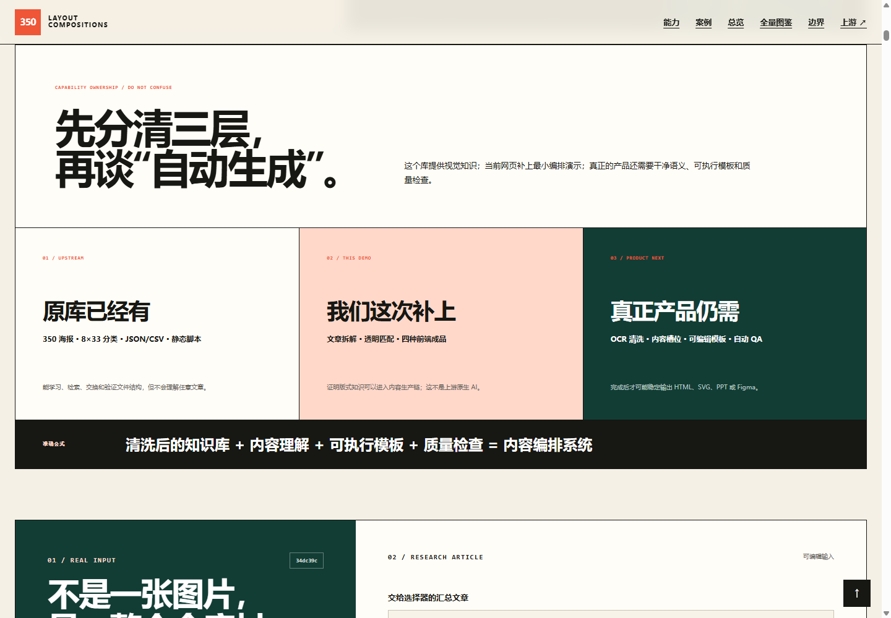

## 已有能力

| 能力层 | 当前能力 | 主要载体 | 边界 |
| --- | --- | --- | --- |
| 知识压缩 | 一个版式概念对应一张带定义、示意和提示的教学海报 | 1086×1448 PNG | 是位图说明，不是参数化模板 |
| 分类体系 | 350 项、8 个一级分类、33 个二级主题 | `catalog.json` / `catalog.csv` | 分类本身不能保证图片语义映射正确 |
| 人工浏览 | README 与 8 个分类 Markdown 画廊 | 缩略图链接高清图 | 没有真正的搜索、收藏或学习状态 |
| 机器读取 | ID、名称、分类、slug、路径、尺寸、SHA-256 | JSON / CSV | 没有槽位、网格、阅读顺序、适用条件等可执行字段 |
| 素材生产 | 导入图片、生成 JPEG 缩略图、目录和画廊 | `scripts/import-350.py` + Pillow | 依赖仓库外的 TSV 映射表与原始素材目录 |
| 结构验证 | 数量、连续编号、唯一性、图片完整性、尺寸、哈希、链接和画廊单元格 | `scripts/verify-collection.py` | 不识别图内文字，因此漏掉语义错位 |

## 底层原理

### 设计知识层

项目把难以描述的视觉经验拆成可命名的版式原型：先是比例、平衡、层级、格式塔和阅读路径，再延伸到网页 UI、影视、中国传统空间与演示页面。名称解决团队沟通问题，海报通过图文双重编码帮助快速理解。

### 工程层

```text
TSV 映射表 + 分组原始图片
        ↓
连续编号、一级/二级分类、规范文件路径
        ↓
1086×1448 PNG + 480×640 JPEG 缩略图
        ↓
catalog.json / catalog.csv + SHA-256
        ↓
README 与分类 Markdown 画廊
        ↓
文件、路径、哈希和链接完整性验证
```

它本质上是一条静态 ETL，而不是在运行时求解版式的算法。详细模块与本 Demo 的获取方式见[架构笔记](notes/architecture.md)。

## 数据质量发现

上游公开 [Issue #1](https://github.com/nevertoday/350-layout-compositions/issues/1) 报告 catalog 与图片内容大面积错位，并报告 350 张海报只覆盖 339 个不同概念，存在 11 个重复概念和 11 个缺失概念。

本研究独立确认了两个样本：

- `087-放射平衡原则` 的图片大标题实际为“棋盘构图”；
- `242-容器查询布局` 的图片大标题实际为“特写跨页”。

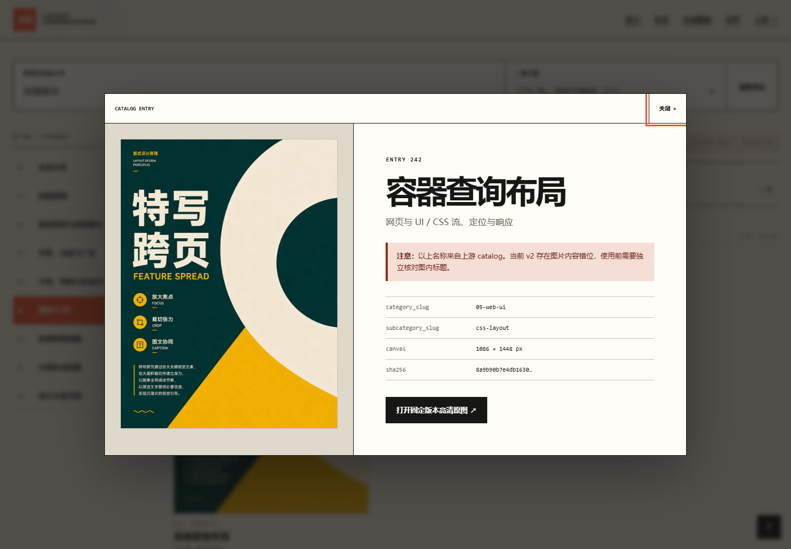

这也揭示了验证架构的典型盲区：哈希只能证明“当前文件没有变”，不能证明“这个文件被赋予了正确语义”。证据、影响和修复顺序见[数据质量笔记](notes/data-quality.md)。

## 使用场景

适合：

- 设计学习、团队培训和版式术语对齐；
- 海报、网页、幻灯片和影视镜头的灵感检索；
- 设计 brief 与生成提示词中的构图词汇；
- 经清洗后的多模态检索、版式推荐和设计评测冷启动数据。

不适合直接承担：

- 任意内容到排版成品的自动生成；
- 响应式网页、PPT、Figma 或 SVG 的可编辑输出；
- 未清洗的训练、RAG 或自动推荐；
- 未核对图片生成来源、人物、品牌和底层素材权利的商业再分发。

## 真实演示：用当前仓库汇总当前仓库

Web Demo 直接把 `350-layout-compositions` 自己作为案例。输入不是另一个项目的一张图，而是包含 README、`catalog.json` / `catalog.csv`、导入与验证脚本、350 张缩略图、固定 commit 和研究结论的完整材料包；旁边是一篇可编辑的中文研究文章。

```text
仓库材料 + 研究文章
        ↓
识别定义 / 数字 / 能力 / 流程 / 边界 / 方向
        ↓
给出可解释的版式候选与选版理由
        ↓
汇总网页 / 6 页社媒轮播 / 单页知识图 / 6 页 PPT 提纲
```

点击“分析文章并生成”后，页面会显示读取字数、六类内容信号和四种实际渲染结果。每条候选决策都同时显示真实上游海报和选择理由。网页用海报拼贴、八类比例图、能力便当盒与 ETL 证据链完成论证；轮播六页分别采用拼贴封面、大数字、模块、流程、风险对照和路线图；知识图用 350 核心数字、真实素材带、八类数据轨道和四象限完成一屏扫描；PPT 则以六张不同的 16:9 微型画面组织现场讲述。它们共用同一组仓库事实，但构图轮廓、信息密度和阅读任务明显不同，不是同一张图换四个标签。

这里最重要的边界是：上游库只提供 350 种版式知识、静态目录和素材管线；文章拆解、规则匹配与前端渲染是本 Demo 新增的最小增强层。当前候选编号和名称仍继承 catalog 的语义错位风险，投入自动推荐前必须经过 OCR 与人工复核。这一案例证明“文章 → 版式 → 多端成品”的方向可行，不证明上游已经拥有 AI。

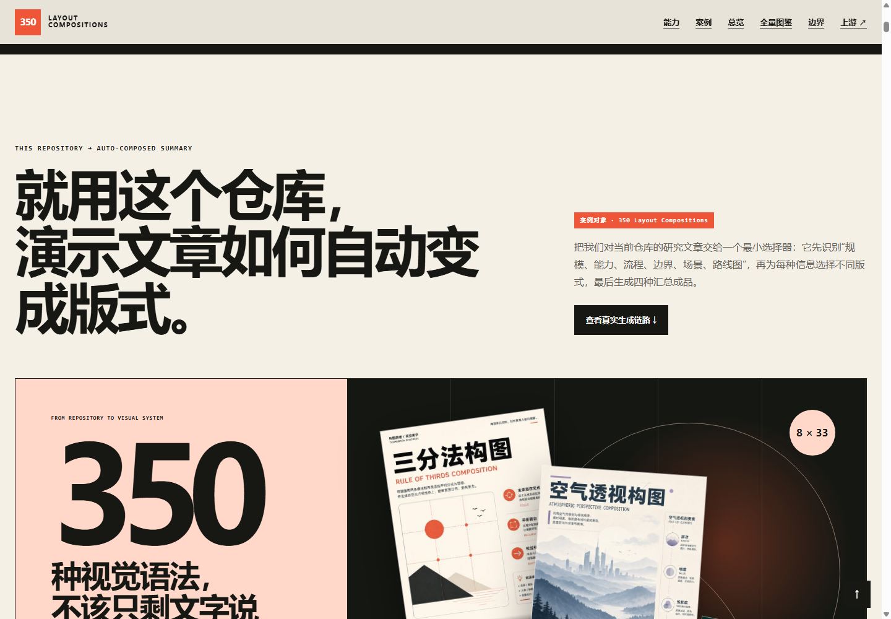

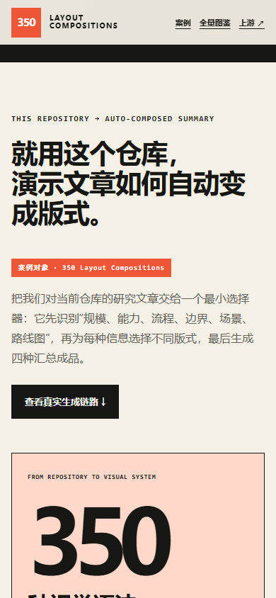

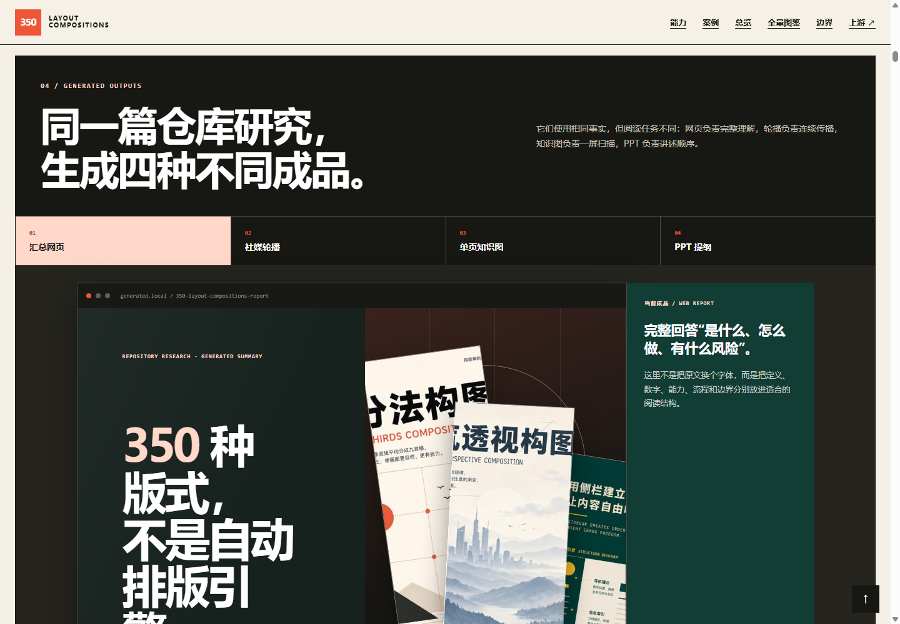

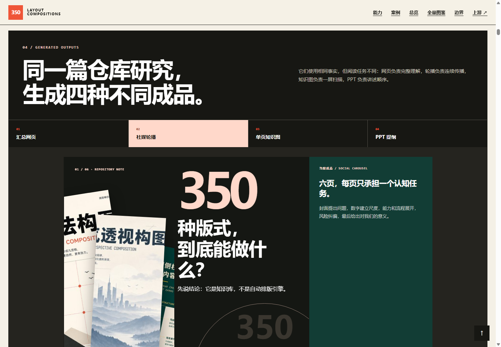

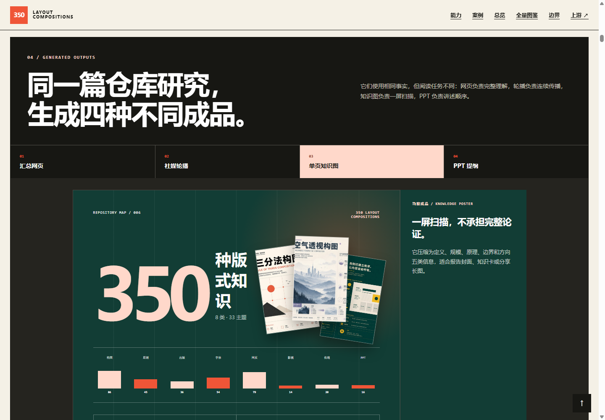

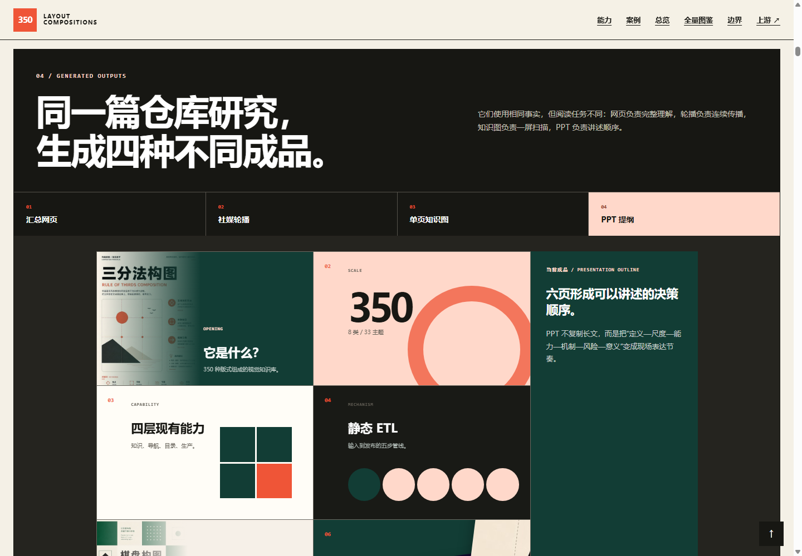

## 实验与验证

| 验证问题 | 方法 | 结果 | 证据 | 限制 |
| --- | --- | --- | --- | --- |
| 上游能否固定取得 | sparse clone 并 checkout 固定 commit | 成功取得 catalog、脚本、文档和 350 张缩略图 | 本地忽略目录 `.codex-tmp/upstreams/350-layout-compositions` | 未把 350 张高清 PNG 复制进总库 |
| 目录规模是否自洽 | 解析固定版本 `catalog.json` | 350 项、350 个唯一名称、8 类、33 主题 | Demo `npm run check` | 自洽不等于语义正确 |
| 原始能力能否全量网页展示 | 构建本地静态图鉴 | 初始 DOM 完整包含 350 项，并按 8 类、33 主题分组；搜索、筛选和详情可用 | [Web Demo](../../apps/006-nevertoday-350-layout-compositions/README.md) | 展示原始上游标签，不替代语义修复 |
| 仓库研究如何进入内容生产 | 把当前仓库材料和可编辑研究文章输入规则分析器，再生成四种结构不同的前端成品 | 命中六类内容信号；网页、6 页轮播、知识图和 6 页 PPT 提纲均可切换查看 | [浏览器验收](../../apps/006-nevertoday-350-layout-compositions/docs/delivery-contract.md) | 规则匹配是 Demo 增强层；候选目录仍需 OCR 与人工复核 |
| 机器目录能否直接取得 | 浏览器和 HTTP 检查 JSON / CSV / meta | JSON 返回 350 项，CSV 为 98,153 bytes，版本信息声明 `full-catalog-grouped` | [浏览器验收](../../apps/006-nevertoday-350-layout-compositions/docs/delivery-contract.md) | CSV 继承上游当前语义错位 |
| 关键交互是否可用 | Chromium 桌面、平板、390px 浏览器检查 | 搜索、空结果、Enter 打开、Escape 关闭与焦点返回通过 | [浏览器验收](../../apps/006-nevertoday-350-layout-compositions/docs/delivery-contract.md) | 未测试真实移动设备和所有浏览器 |
| catalog 失败是否有回退 | 浏览器拦截 `catalog.json` 后重载 | 显示失败解释与“重新加载”；恢复网络后可重试成功 | 浏览器验收记录 | 不是离线 PWA |

## 优点与局限

### 优点

- 覆盖面广，能为设计、产品和 Agent 建立共同版式词汇；
- JSON/CSV、稳定编号和哈希使图片集合具备基本工程可用性；
- 静态 Markdown 与缩略图方案简单、便携、维护成本低；
- CC BY 4.0 允许在署名条件下分享和改编。

### 局限

- 当前 v2 的目录到图片语义映射不可靠；
- 绝大部分知识仍封装在位图文字里，程序无法直接取得定义和规则；
- 所有新图都是固定 3:4 教学海报，不代表不同媒介和比例中的真实适配；
- 没有可执行模板、推荐算法、运行时 API 或组件库；
- 上游 README 另行提醒商业使用前确认生成来源和人物、品牌、素材权利，CC BY 4.0 不能替代这项核查。

## 对我们的意义

它最值得迁移的不是海报外观，而是“先建立视觉词汇，再让词汇进入工具链”的思路。对本总库而言，下一步不应再做一个普通图片画廊，而应验证下面这条链路：

```text
内容意图与媒介约束
        ↓
召回 3–5 个版式原型
        ↓
生成槽位、网格与阅读顺序
        ↓
渲染 HTML / SVG / 幻灯片
        ↓
视觉层级、对比度与响应式 QA
```

本 Demo 同时完成了两个最小闭环：先在尊重数据质量边界的前提下，把 350 项原始目录完整整理为一个网页档案；再用这份仓库研究文章本身，展示版式知识如何进入可解释选版，并实际生成汇总网页、社媒轮播、知识图和 PPT 提纲。页面继续按“一级分类 → 二级主题 → 条目”展开全部 350 项，并保留搜索、筛选、详情和机器目录下载。

## Web Demo

- 源码：[`apps/006-nevertoday-350-layout-compositions/`](../../apps/006-nevertoday-350-layout-compositions/)
- 本地预览：进入应用目录执行 `npm ci` 与 `npm run preview`，然后打开 `http://127.0.0.1:4197/`；不要直接双击 `src/index.html`
- 在线地址：`https://yydshly.github.io/0902_codex_project/demos/006-nevertoday-350-layout-compositions/`
- 验证边界：证明固定版本素材、机器目录和分类浏览可以被整合成静态产品；不证明 catalog 标签正确，也不提供自动排版。

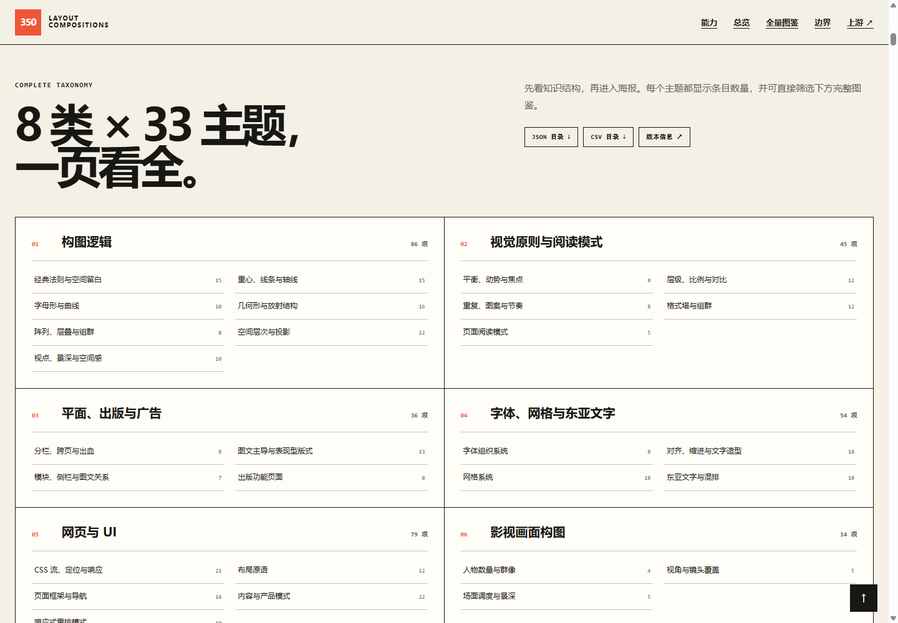

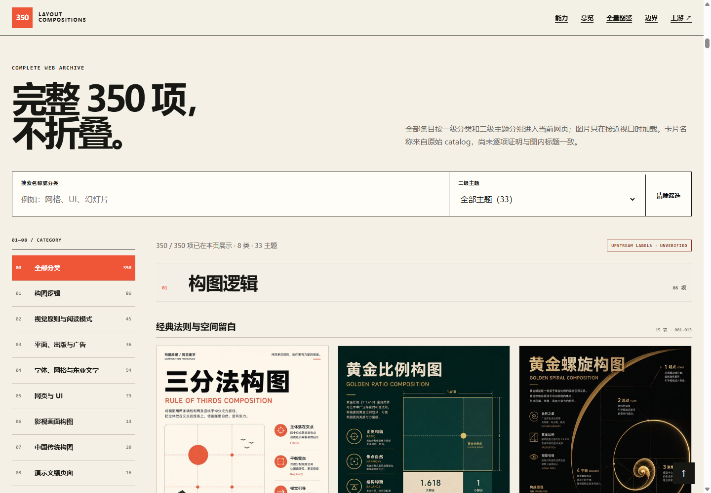

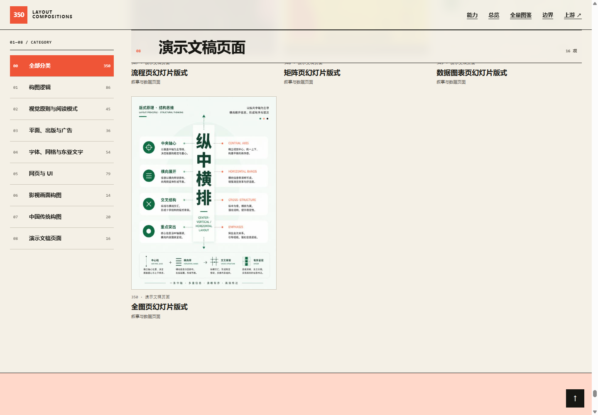

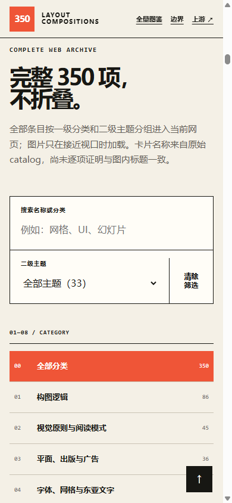

## 展示素材

上述截图由本研究 Demo 在本地 Chromium 中生成，最近截图时间为 `2026-09-04`。页面外壳为本项目原创；其中出现的教学海报来自上游固定 commit，遵循 CC BY 4.0。逐张替代文本、研究意义与来源见 [`assets/README.md`](assets/README.md)。

## 来源与相关链接

- [上游 README](https://github.com/nevertoday/350-layout-compositions/blob/34dc39cb5128776b594754624fa2202d5942a35b/README.md)
- [上游 catalog.json](https://github.com/nevertoday/350-layout-compositions/blob/34dc39cb5128776b594754624fa2202d5942a35b/v2/catalog.json)
- [导入脚本](https://github.com/nevertoday/350-layout-compositions/blob/34dc39cb5128776b594754624fa2202d5942a35b/scripts/import-350.py)
- [验证脚本](https://github.com/nevertoday/350-layout-compositions/blob/34dc39cb5128776b594754624fa2202d5942a35b/scripts/verify-collection.py)
- [CC BY 4.0 许可证](https://github.com/nevertoday/350-layout-compositions/blob/34dc39cb5128776b594754624fa2202d5942a35b/LICENSE)
- [上游数据错位 Issue #1](https://github.com/nevertoday/350-layout-compositions/issues/1)

## 变更记录

- `2026-09-03`：固定上游版本，完成能力、架构和数据质量研究，建立可检索 Web Demo 并通过浏览器验收。
- `2026-09-04`：修订 7 将案例改为当前仓库自我汇总：真实仓库材料和可编辑文章进入六类规则分析，给出可解释选版并生成网页、轮播、知识图和 PPT 提纲；页面明确区分上游知识库、Demo 增强层与 catalog 语义风险。
- `2026-09-04`：修订 8–9 把真实海报、八类数据图和媒介专属构图接入四种输出，并用三层能力账本统一研究文档、网页与总库项目索引的能力表述。
