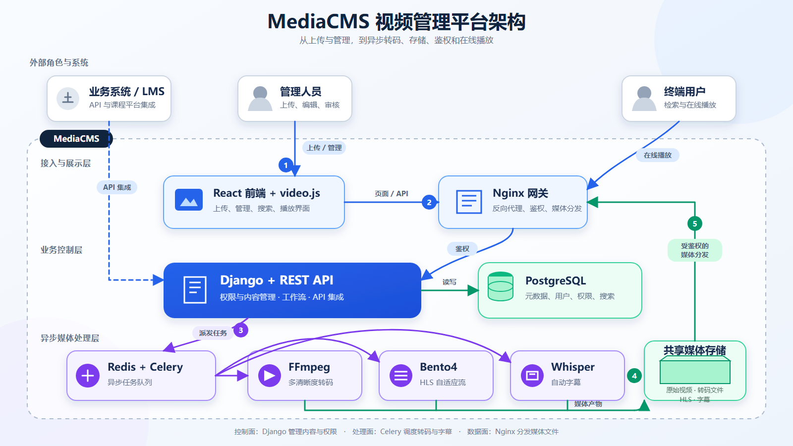

# MediaCMS：完整媒体平台，而不是视频组件

> 一句话结论：MediaCMS 可以概括为“媒体库管理系统”，但它实际覆盖的是 **媒体资产管理 + 异步加工 + 权限治理 + 搜索与播放门户**。只有当团队确实需要拥有自己的媒体库、数据和处理链路时，它的研究与采用价值才会明显上升。

- 上游仓库：[mediacms-io/mediacms](https://github.com/mediacms-io/mediacms)
- 研究版本：[`v8.4.0`](https://github.com/mediacms-io/mediacms/releases/tag/v8.4.0)
- 固定提交：[`d146be7c3c6828075dfc83719c37819f1b6fbef7`](https://github.com/mediacms-io/mediacms/tree/d146be7c3c6828075dfc83719c37819f1b6fbef7)
- 上游许可证：[AGPL-3.0](https://github.com/mediacms-io/mediacms/blob/d146be7c3c6828075dfc83719c37819f1b6fbef7/LICENSE)
- 在线研究页：[MediaCMS Decision Atlas](https://yydshly.github.io/0902_codex_project/demos/009-mediacms-io-mediacms/)
- Demo 源码：[apps/009-mediacms-io-mediacms](../../apps/009-mediacms-io-mediacms/)

## 我们最终如何理解它

把它叫作“媒体库管理系统”是对的，但还不够完整。

| 层次 | MediaCMS 负责什么 | 不是它的重点 |
| --- | --- | --- |
| 资产层 | 视频、音频、图片、PDF 的入库、元数据、分类、标签、列表与搜索 | 通用网盘或纯对象存储控制台 |
| 加工层 | FFmpeg 转码与缩略图、Bento4 HLS、可选 Whisper 字幕 | 通用工作流编排平台 |
| 治理层 | 公开/私有/非公开、直接授权、分类组 RBAC、SAML、LTI 1.3 | 开箱即用的复杂多租户 SaaS 治理 |
| 体验层 | React 管理门户、搜索、分享与 video.js 播放 | 可嵌入任意业务的轻量播放器 SDK |

所以更精确的定义是：**一套可自托管的媒体内容管理与点播门户**。它的价值不只在“保存文件”，而在把内容进入系统后必须经过的管理、处理、授权与交付动作连起来。

## 它有哪些能力

基于固定版本 README 和源码，能够确认的核心能力包括：

- 支持视频、音频、图片和 PDF，并提供分片/续传式上传入口。
- 视频转码、缩略图、多分辨率输出和 HLS 打包采用异步任务处理。
- 可选在本地运行 Whisper，把语音识别结果写成 WebVTT 字幕。
- 提供分类、标签、播放列表、评论、互动与 PostgreSQL 全文检索；字幕文本也可以进入搜索。
- 支持公开、私有、非公开链接、单媒体直接授权和基于分类组的角色权限。
- 能以 SAML 接入身份系统，以 LTI 1.3 接入 Moodle 等学习系统。
- Web 层由 React 和 video.js 提供管理与播放体验；后端提供 Django REST API。

这些是项目已实现的系统能力，不等于在任何容量、安全或网络环境下都已经完成生产验证。

## 底层原理

### 1. 上传与入库

浏览器将大文件分片上传；服务端在 [`uploader/views.py`](https://github.com/mediacms-io/mediacms/blob/d146be7c3c6828075dfc83719c37819f1b6fbef7/uploader/views.py) 合并分片并创建媒体记录。媒体模型识别类型、维护文件路径、缩略图、编码状态和搜索字段，见 [`files/models/media.py`](https://github.com/mediacms-io/mediacms/blob/d146be7c3c6828075dfc83719c37819f1b6fbef7/files/models/media.py)。

### 2. 异步处理

Django 将耗时操作交给 Redis/Celery。Worker 在 [`files/tasks.py`](https://github.com/mediacms-io/mediacms/blob/d146be7c3c6828075dfc83719c37819f1b6fbef7/files/tasks.py) 调用 FFmpeg 探测与转码；成功生成 H.264 MP4 后，Bento4 可继续打包 HLS；Whisper 可选生成字幕。这个设计把 HTTP 请求与 CPU 密集任务隔离，但也引入了队列、worker、任务重试和共享存储运维。

### 3. 权限与播放

媒体请求先到 Nginx。私有内容可以通过 `auth_request` 调用 Django 权限接口；[`files/views/media_auth.py`](https://github.com/mediacms-io/mediacms/blob/d146be7c3c6828075dfc83719c37819f1b6fbef7/files/views/media_auth.py) 综合媒体状态、所有者、编辑者、分类组与直接授权判断访问，并使用 Redis 缓存结果。通过后，Nginx 从共享媒体目录交付文件或 HLS，浏览器用 video.js 播放。

### 4. 数据分工

- PostgreSQL 保存用户、媒体元数据、权限关系和全文搜索向量。
- Redis 同时承担 Celery broker 和部分缓存职责。
- 共享媒体存储保存原件、转码结果、HLS、缩略图和字幕。
- Django/Gunicorn 是控制面，Nginx 和文件存储承载大文件交付的数据面。

官方开发文档的 “System architecture” 小节在本次快照中仍标注待编写，因此上图是我们根据配置、模型、任务与鉴权源码得到的架构归纳，不是上游官方图。

## 它是不是很重

**是，相对于播放器组件、对象存储上传页或云点播 SDK，它明显偏重。**

“重”不是贬义，而是完整平台的成本：

- 运行时至少涉及 Nginx、Django/Gunicorn、PostgreSQL、Redis、Celery worker/beat，以及 FFmpeg、Bento4，启用字幕时还要考虑 Whisper 模型与算力。
- 视频转码消耗 CPU、内存和时间；上传高峰与处理高峰需要分开容量规划。
- README 建议按原文件约 **3 倍** 预留空间，因为系统同时保存原件、编码版本与 HLS。
- 横向扩展 Web 和 worker 时，它们需要看到同一份媒体文件，通常会引入 NFS/EFS 一类共享文件系统。
- 备份不能只备 PostgreSQL，还要同步考虑媒体文件、配置、缓存重建与任务恢复。

因此，原型部署并不难，长期稳定地运营一个不断增长的媒体库才是成本所在。

## 什么情况下值得用

### 适合

- 企业内部视频、会议、培训、知识资产需要集中治理。
- 教育机构要做点播门户，并与 SSO、Moodle/LMS 或组织权限结合。
- 素材敏感或合规要求使团队不能把媒体托管到公共 SaaS。
- 已经有明确的媒体运营流程：上传、审核、分类、授权、发布、检索、归档。
- 准备建设 AI 视频知识库，希望先拥有字幕、元数据、权限和媒体处理底座。

### 不适合

- 只是给现有产品加一个播放器，或只上传、播放少量文件。
- 核心需求是直播、超低延迟、商业 DRM 或广播级编排。
- 一开始就要求全球大规模分发、对象存储直传和云转码弹性，而团队无意改造底层。
- 团队不愿承担数据库、队列、转码、共享存储、升级和安全响应。
- 商业模式或闭源要求与 AGPL-3.0 的义务存在冲突，且无法通过合规设计解决。

## 可扩展方向

优先级应该从基础设施约束向产品增量推进：

1. **对象存储与 CDN 抽象。** 代码多处直接使用媒体文件的本地 `.path`、`os.path.exists` 和系统文件命令；S3/MinIO 不是简单替换配置，需要统一存储接口、直传、签名 URL、生命周期和缓存策略。
2. **弹性转码后端。** 把当前 Celery + 本机工具扩展为 GPU worker、独立转码集群或云转码适配器，并补齐幂等、重试、优先级、取消、进度和成本观测。
3. **AI 媒体知识层。** 在现有 Whisper 与全文检索上增加说话人分离、章节、摘要、OCR、内容审核、向量索引、片段定位和带权限的视频问答。
4. **企业治理。** 增强 OIDC/SCIM、不可抵赖审计、保留与删除策略、水印、DRM、细粒度租户隔离和合规导出。
5. **产品形态扩展。** 移动端、直播、创作者工作台、Webhook/事件总线、开放插件机制和观看质量分析。

前两个方向决定系统能否可靠放大，后两个方向决定它能否形成组织级产品差异。

## 对我们的意义

### 如果没有自己的媒体库需求

不建议把 MediaCMS 当作重点技术栈研究。了解它的边界即可：它可以作为完整媒体平台的案例，帮助我们认识“上传一个视频”背后实际涉及的处理、权限、存储和交付链路。具体项目仍优先采用对象存储、CDN、云点播或轻量播放器组合。

### 如果要建设自己的媒体库

研究价值很高，但更适合作为 **基线平台与架构样本**，而不是未经验证直接定为最终底座。建议用真实素材做 PoC，至少验证：

1. 目标文件大小、格式与并发下的上传成功率。
2. 目标规格的转码耗时、失败恢复与资源消耗。
3. 权限模型是否能表达现有组织与内容流程。
4. 容量增长、备份恢复、共享存储和 CDN 方案。
5. 升级策略、安全维护与 AGPL-3.0 合规边界。

最终判断可以压缩为一句话：**有需要自己掌控的媒体资产问题，就值得深入；没有，就把它留在候选库。**

## 证据、推断与未验证项

| 类型 | 内容 | 状态 |
| --- | --- | --- |
| 上游事实 | 技术栈、媒体类型、权限、HLS、Whisper、SAML/LTI、存储估算 | 已由 README、配置与源码交叉检查 |
| 代码推断 | 控制面/数据面分工；对象存储改造量大；横向扩展依赖共享媒体文件 | 基于固定提交实现方式推断 |
| 我们的评价 | 研究价值按需、总体偏重、优先改造基础设施再做 AI | 决策建议，不是上游承诺 |
| 未验证 | 生产容量、故障恢复、升级兼容、真实 SSO/LMS、对象存储改造效果 | 本轮未部署 MediaCMS 本体 |

## 一手来源

- [README：定位、能力、组件与存储估算](https://github.com/mediacms-io/mediacms/blob/d146be7c3c6828075dfc83719c37819f1b6fbef7/README.md)
- [CHANGELOG：v8.4.0 版本记录](https://github.com/mediacms-io/mediacms/blob/d146be7c3c6828075dfc83719c37819f1b6fbef7/CHANGELOG.md)
- [媒体模型：文件、状态与搜索向量](https://github.com/mediacms-io/mediacms/blob/d146be7c3c6828075dfc83719c37819f1b6fbef7/files/models/media.py)
- [编码模型](https://github.com/mediacms-io/mediacms/blob/d146be7c3c6828075dfc83719c37819f1b6fbef7/files/models/encoding.py)
- [异步任务：FFmpeg、HLS 与 Whisper](https://github.com/mediacms-io/mediacms/blob/d146be7c3c6828075dfc83719c37819f1b6fbef7/files/tasks.py)
- [分片上传与合并](https://github.com/mediacms-io/mediacms/blob/d146be7c3c6828075dfc83719c37819f1b6fbef7/uploader/views.py)
- [媒体访问鉴权](https://github.com/mediacms-io/mediacms/blob/d146be7c3c6828075dfc83719c37819f1b6fbef7/files/views/media_auth.py)
- [系统配置：PostgreSQL、Redis、Celery 与媒体目录](https://github.com/mediacms-io/mediacms/blob/d146be7c3c6828075dfc83719c37819f1b6fbef7/cms/settings.py)
- [开发与扩容文档](https://github.com/mediacms-io/mediacms/blob/d146be7c3c6828075dfc83719c37819f1b6fbef7/docs/developers_docs.md)
- [媒体权限文档](https://github.com/mediacms-io/mediacms/blob/d146be7c3c6828075dfc83719c37819f1b6fbef7/docs/media_permissions.md)
- [安全支持策略](https://github.com/mediacms-io/mediacms/blob/d146be7c3c6828075dfc83719c37819f1b6fbef7/SECURITY.md)
- [AGPL-3.0 第 13 节](https://www.gnu.org/licenses/agpl-3.0.en.html#section13)

## 本轮验证

- 固定版本源码与官方文档检查：完成。
- 架构图和决策型静态 Demo：完成。
- 生产构建、目录结构与固定证据校验：完成。
- 桌面、手机、键盘和交互浏览器验收：见 Demo 的交付记录。
- MediaCMS 本体安装、转码压测与生产部署：**未执行，也不应由研究页结果替代。**
